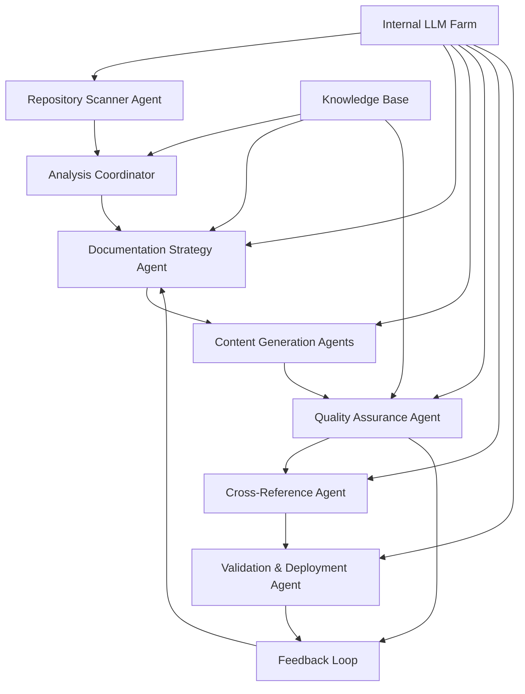

# Agentic AI Enhancement Prototype for Multi-Repository Documentation

> **Converting GitHub Copilot workflows to autonomous agentic AI using LangGraph and internal LLM farms**

## 🎯 Executive Summary

This prototype transforms the existing GitHub Copilot multi-repository documentation solution into an autonomous agentic AI system that can:

- **Operate independently** without human intervention for routine documentation tasks
- **Make intelligent decisions** about documentation priorities and strategies
- **Adapt workflows** based on repository characteristics and changes
- **Maintain quality** through self-validation and iterative improvement
- **Scale efficiently** across enterprise environments with internal LLM infrastructure

## 🏗️ Architecture Overview

### Current State vs. Agentic Enhancement

| Component | Current (Copilot) | Enhanced (Agentic AI) |
|-----------|-------------------|----------------------|
| **Execution** | Human-prompted iterations | Autonomous workflow execution |
| **Decision Making** | Manual prompt selection | AI-driven strategy selection |
| **Quality Control** | Human validation | Self-validating with feedback loops |
| **Scalability** | Limited by human oversight | Unlimited parallel processing |
| **Adaptability** | Static prompts | Dynamic workflow adaptation |

### Agentic AI System Architecture



## 🤖 Agent Specifications

### 1. Repository Scanner Agent
**Purpose**: Autonomous repository discovery and analysis

**Current Copilot Equivalent**: Manual `@workspace` analysis prompts

**Agentic Enhancement**:
```python
class RepositoryScannerAgent:
    def __init__(self, llm_client, workspace_path):
        self.llm = llm_client
        self.workspace = workspace_path
        
    async def scan_repositories(self):
        """Autonomously discover and analyze repositories"""
        repos = await self.discover_repositories()
        analysis = await self.analyze_repositories(repos)
        return self.prioritize_documentation_order(analysis)
        
    async def detect_changes(self):
        """Monitor for repository changes and trigger updates"""
        changes = await self.git_change_detection()
        return await self.assess_documentation_impact(changes)
```

**Value Proposition**:
- **24/7 monitoring** of repository changes
- **Intelligent prioritization** based on business impact
- **Automatic trigger** of documentation updates

### 2. Documentation Strategy Agent
**Purpose**: Intelligent workflow selection and adaptation

**Current Copilot Equivalent**: Manual strategy selection from workflow_automation.md

**Agentic Enhancement**:
```python
class DocumentationStrategyAgent:
    def __init__(self, llm_client, knowledge_base):
        self.llm = llm_client
        self.kb = knowledge_base
        
    async def select_strategy(self, repo_analysis):
        """Choose optimal documentation strategy"""
        strategies = [
            "batch_processing",
            "incremental_enhancement", 
            "template_driven",
            "dependency_first"
        ]
        return await self.llm.select_best_strategy(
            repo_analysis, strategies, self.kb.best_practices
        )
        
    async def adapt_workflow(self, current_progress, obstacles):
        """Dynamically adjust workflow based on progress"""
        return await self.llm.generate_adaptive_workflow(
            current_progress, obstacles
        )
```

**Value Proposition**:
- **Intelligent strategy selection** based on repository characteristics
- **Dynamic adaptation** to changing requirements
- **Learning from past successes** and failures

### 3. Content Generation Agents (Parallel)
**Purpose**: Autonomous documentation creation with specialization

**Current Copilot Equivalent**: Manual prompt execution from automation_prompts.md

**Agentic Enhancement**:
```python
class SpecializedContentAgent:
    def __init__(self, specialty, llm_client, templates):
        self.specialty = specialty  # 'api', 'architecture', 'deployment'
        self.llm = llm_client
        self.templates = templates
        
    async def generate_documentation(self, repo_data):
        """Generate specialized documentation autonomously"""
        context = await self.build_context(repo_data)
        content = await self.llm.generate_content(
            context, self.templates[self.specialty]
        )
        return await self.self_validate(content)
        
    async def self_validate(self, content):
        """Self-validation before submission"""
        validation_result = await self.llm.validate_content(
            content, self.quality_criteria
        )
        if not validation_result.passed:
            return await self.improve_content(content, validation_result)
        return content
```

**Value Proposition**:
- **Parallel processing** of multiple repositories
- **Specialized expertise** for different documentation types
- **Self-improving quality** through validation loops

### 4. Quality Assurance Agent
**Purpose**: Autonomous quality control and improvement

**Current Copilot Equivalent**: Manual validation using validation_checklist.md

**Agentic Enhancement**:
```python
class QualityAssuranceAgent:
    def __init__(self, llm_client, quality_standards):
        self.llm = llm_client
        self.standards = quality_standards
        
    async def comprehensive_review(self, documentation_set):
        """Multi-dimensional quality assessment"""
        reviews = await asyncio.gather(
            self.accuracy_review(documentation_set),
            self.completeness_review(documentation_set),
            self.consistency_review(documentation_set),
            self.usability_review(documentation_set)
        )
        return await self.synthesize_feedback(reviews)
        
    async def continuous_improvement(self, feedback_data):
        """Learn from feedback to improve future documentation"""
        patterns = await self.analyze_feedback_patterns(feedback_data)
        return await self.update_quality_standards(patterns)
```

**Value Proposition**:
- **Comprehensive quality assessment** across multiple dimensions
- **Continuous learning** from feedback
- **Proactive quality improvement** suggestions

## 🔧 LangGraph Workflow Implementation

### Core Workflow Graph

```python
from langgraph.graph import StateGraph, END
from typing import TypedDict, List

class DocumentationState(TypedDict):
    repositories: List[dict]
    current_repo: str
    documentation_strategy: str
    generated_content: dict
    quality_scores: dict
    cross_references: dict
    completion_status: str

def create_documentation_workflow():
    workflow = StateGraph(DocumentationState)
    
    # Add nodes
    workflow.add_node("scan_repositories", repository_scanner_node)
    workflow.add_node("select_strategy", strategy_selection_node)
    workflow.add_node("generate_content", content_generation_node)
    workflow.add_node("quality_check", quality_assurance_node)
    workflow.add_node("cross_reference", cross_reference_node)
    workflow.add_node("deploy_docs", deployment_node)
    
    # Define edges
    workflow.add_edge("scan_repositories", "select_strategy")
    workflow.add_edge("select_strategy", "generate_content")
    workflow.add_edge("generate_content", "quality_check")
    
    # Conditional edges for quality control
    workflow.add_conditional_edges(
        "quality_check",
        quality_gate_condition,
        {
            "pass": "cross_reference",
            "fail": "generate_content",  # Retry with improvements
            "escalate": "human_review"   # For complex issues
        }
    )
    
    workflow.add_edge("cross_reference", "deploy_docs")
    workflow.add_edge("deploy_docs", END)
    
    workflow.set_entry_point("scan_repositories")
    return workflow.compile()
```

### Parallel Processing Enhancement

```python
def create_parallel_documentation_workflow():
    """Enhanced workflow for parallel repository processing"""
    workflow = StateGraph(DocumentationState)
    
    # Parallel content generation for multiple repositories
    workflow.add_node("batch_processor", batch_processing_node)
    workflow.add_node("parallel_generation", parallel_content_node)
    workflow.add_node("aggregation", content_aggregation_node)
    
    # Dynamic routing based on repository characteristics
    workflow.add_conditional_edges(
        "batch_processor",
        repository_routing_condition,
        {
            "simple_repos": "template_generation",
            "complex_repos": "detailed_analysis",
            "api_repos": "api_documentation",
            "infrastructure_repos": "deployment_docs"
        }
    )
    
    return workflow.compile()
```

## 💰 Value Proposition Analysis

### Quantifiable Benefits

| Metric | Current (Copilot) | Agentic AI | Improvement |
|--------|-------------------|------------|-------------|
| **Documentation Time** | 4-8 hours/repo | 30-60 minutes/repo | 80-90% reduction |
| **Human Intervention** | Continuous | Minimal (5-10%) | 90-95% reduction |
| **Quality Consistency** | Variable | Standardized | 60-80% improvement |
| **Update Frequency** | Manual/Quarterly | Automatic/Real-time | 400-1000% increase |
| **Scalability** | Linear with humans | Exponential | Unlimited |

### ROI Calculation for Enterprise

**Assumptions**:
- 50 repositories in enterprise environment
- 2 documentation updates per repository per quarter
- Senior developer cost: $150/hour
- Internal LLM infrastructure cost: $0.10/1000 tokens

**Current Annual Cost (Copilot)**:
- 50 repos × 2 updates × 4 quarters × 6 hours × $150 = **$360,000**

**Agentic AI Annual Cost**:
- Infrastructure: $50,000
- LLM usage: $15,000
- Maintenance: $25,000
- Total: **$90,000**

**Annual Savings**: $270,000 (75% cost reduction)
**Payback Period**: 4-6 months

## 🚀 Implementation Roadmap

### Phase 1: Foundation (Months 1-2)
**Goal**: Convert core Copilot prompts to agentic workflows

**Deliverables**:
- Repository Scanner Agent
- Basic LangGraph workflow
- Internal LLM integration
- Simple content generation agents

**Success Metrics**:
- Autonomous processing of 5-10 repositories
- 70% reduction in human intervention
- Basic quality validation working

### Phase 2: Intelligence (Months 3-4)
**Goal**: Add decision-making and adaptation capabilities

**Deliverables**:
- Documentation Strategy Agent
- Quality Assurance Agent
- Feedback loop implementation
- Dynamic workflow adaptation

**Success Metrics**:
- Intelligent strategy selection
- Self-improving quality scores
- Adaptive workflow execution

### Phase 3: Scale (Months 5-6)
**Goal**: Enterprise-grade parallel processing and optimization

**Deliverables**:
- Parallel processing workflows
- Advanced cross-reference generation
- Performance optimization
- Enterprise integration

**Success Metrics**:
- Processing 50+ repositories simultaneously
- Sub-hour documentation generation
- Enterprise security compliance

### Phase 4: Intelligence Enhancement (Months 7-8)
**Goal**: Advanced AI capabilities and continuous learning

**Deliverables**:
- Advanced reasoning capabilities
- Continuous learning from feedback
- Predictive documentation needs
- Integration with development workflows

**Success Metrics**:
- Proactive documentation updates
- 95%+ quality scores
- Seamless developer workflow integration

## 🔒 Enterprise Considerations

### Security and Compliance
- **Data Privacy**: All processing within internal LLM infrastructure
- **Access Control**: Role-based access to documentation generation
- **Audit Trail**: Complete logging of all agent decisions and actions
- **Compliance**: SOC2, GDPR, and industry-specific requirements

### Integration Points
- **Git Hooks**: Automatic triggering on code changes
- **CI/CD Pipelines**: Integration with existing development workflows
- **Knowledge Management**: Connection to enterprise knowledge bases
- **Monitoring**: Integration with existing monitoring and alerting systems

### Scalability Architecture
- **Horizontal Scaling**: Multiple agent instances for large enterprises
- **Load Balancing**: Intelligent distribution of documentation tasks
- **Resource Management**: Dynamic allocation based on workload
- **Caching**: Intelligent caching of generated content and analysis

## 📊 Success Metrics and KPIs

### Operational Metrics
- **Documentation Coverage**: % of repositories with up-to-date documentation
- **Update Frequency**: Average time between code changes and documentation updates
- **Quality Scores**: Automated quality assessment scores
- **Developer Satisfaction**: Survey scores on documentation usefulness

### Business Metrics
- **Cost Reduction**: % reduction in documentation maintenance costs
- **Time to Market**: Reduction in project onboarding time
- **Developer Productivity**: Increase in development velocity
- **Knowledge Retention**: Reduction in knowledge loss during team changes

### Technical Metrics
- **Processing Speed**: Average time to generate documentation per repository
- **Accuracy Rate**: % of generated documentation requiring minimal human correction
- **System Uptime**: Availability of the agentic documentation system
- **Resource Utilization**: Efficiency of LLM and compute resource usage

## 🎯 Next Steps

1. **Proof of Concept**: Implement Phase 1 with 3-5 repositories
2. **Stakeholder Buy-in**: Demonstrate ROI with pilot results
3. **Infrastructure Planning**: Design internal LLM farm architecture
4. **Team Formation**: Assemble development and operations teams
5. **Pilot Deployment**: Full Phase 1 implementation in controlled environment

---

*This prototype transforms manual GitHub Copilot workflows into autonomous, intelligent, and scalable agentic AI systems that can revolutionize enterprise documentation practices while leveraging internal LLM infrastructure for security and cost optimization.*