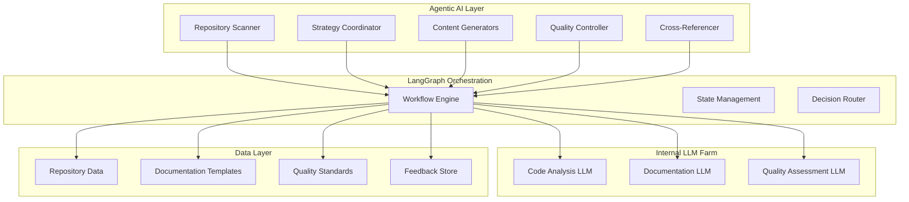

# Agentic AI Implementation Guide: Technical Deep Dive

> **Step-by-step technical implementation for converting Copilot workflows to autonomous agentic AI**

## 🏗️ Technical Architecture

### System Components Overview



## 🔧 Core Implementation

### 1. Internal LLM Client Integration

```python
# llm_client.py
import asyncio
import aiohttp
from typing import Dict, List, Optional
from dataclasses import dataclass

@dataclass
class LLMResponse:
    content: str
    confidence: float
    tokens_used: int
    model_used: str

class InternalLLMClient:
    """Client for internal LLM farm integration"""
    
    def __init__(self, base_url: str, api_key: str):
        self.base_url = base_url
        self.api_key = api_key
        self.session = None
        
    async def __aenter__(self):
        self.session = aiohttp.ClientSession(
            headers={"Authorization": f"Bearer {self.api_key}"}
        )
        return self
        
    async def __aexit__(self, exc_type, exc_val, exc_tb):
        if self.session:
            await self.session.close()
    
    async def generate_content(
        self, 
        prompt: str, 
        model: str = "documentation-specialist",
        max_tokens: int = 4000,
        temperature: float = 0.3
    ) -> LLMResponse:
        """Generate content using internal LLM"""
        payload = {
            "model": model,
            "prompt": prompt,
            "max_tokens": max_tokens,
            "temperature": temperature,
            "stream": False
        }
        
        async with self.session.post(
            f"{self.base_url}/v1/completions", 
            json=payload
        ) as response:
            result = await response.json()
            
            return LLMResponse(
                content=result["choices"][0]["text"],
                confidence=result.get("confidence", 0.8),
                tokens_used=result["usage"]["total_tokens"],
                model_used=model
            )
    
    async def analyze_code(
        self, 
        code_content: str, 
        file_path: str
    ) -> Dict:
        """Analyze code structure and dependencies"""
        prompt = f"""
        Analyze the following code file and provide structured analysis:
        
        File: {file_path}
        Code:
        ```
        {code_content}
        ```
        
        Provide analysis in JSON format with:
        - purpose: Brief description of what this code does
        - dependencies: List of external dependencies
        - api_endpoints: List of API endpoints if applicable
        - complexity: Simple/Medium/Complex
        - documentation_needs: List of documentation sections needed
        """
        
        response = await self.generate_content(
            prompt, 
            model="code-analysis-specialist",
            temperature=0.1
        )
        
        try:
            import json
            return json.loads(response.content)
        except json.JSONDecodeError:
            # Fallback parsing if JSON is malformed
            return self._parse_analysis_fallback(response.content)
    
    def _parse_analysis_fallback(self, content: str) -> Dict:
        """Fallback parser for non-JSON responses"""
        # Implementation for parsing structured text responses
        return {
            "purpose": "Analysis parsing failed",
            "dependencies": [],
            "api_endpoints": [],
            "complexity": "Medium",
            "documentation_needs": ["README", "API Documentation"]
        }
```

### 2. Repository Scanner Agent

```python
# agents/repository_scanner.py
import os
import git
import asyncio
from pathlib import Path
from typing import List, Dict, Optional
from dataclasses import dataclass
from llm_client import InternalLLMClient

@dataclass
class RepositoryInfo:
    name: str
    path: str
    language: str
    size: int
    last_modified: str
    dependencies: List[str]
    complexity: str
    documentation_status: str
    priority: int

class RepositoryScannerAgent:
    """Autonomous repository discovery and analysis agent"""
    
    def __init__(self, workspace_path: str, llm_client: InternalLLMClient):
        self.workspace_path = Path(workspace_path)
        self.llm_client = llm_client
        self.supported_languages = {
            '.py': 'Python',
            '.js': 'JavaScript', 
            '.ts': 'TypeScript',
            '.java': 'Java',
            '.go': 'Go',
            '.rs': 'Rust',
            '.cpp': 'C++',
            '.c': 'C'
        }
    
    async def scan_workspace(self) -> List[RepositoryInfo]:
        """Scan workspace and analyze all repositories"""
        repositories = []
        
        for item in self.workspace_path.iterdir():
            if item.is_dir() and not item.name.startswith('.'):
                if self._is_repository(item):
                    repo_info = await self._analyze_repository(item)
                    if repo_info:
                        repositories.append(repo_info)
        
        # Sort by priority (complexity and business impact)
        return sorted(repositories, key=lambda x: x.priority, reverse=True)
    
    def _is_repository(self, path: Path) -> bool:
        """Check if directory is a code repository"""
        indicators = [
            path / '.git',
            path / 'package.json',
            path / 'requirements.txt',
            path / 'go.mod',
            path / 'Cargo.toml',
            path / 'pom.xml'
        ]
        return any(indicator.exists() for indicator in indicators)
    
    async def _analyze_repository(self, repo_path: Path) -> Optional[RepositoryInfo]:
        """Analyze individual repository"""
        try:
            # Basic file system analysis
            language = self._detect_primary_language(repo_path)
            size = self._calculate_repo_size(repo_path)
            last_modified = self._get_last_modified(repo_path)
            
            # LLM-powered analysis
            code_sample = self._get_representative_code(repo_path)
            analysis = await self.llm_client.analyze_code(
                code_sample, 
                str(repo_path)
            )
            
            # Documentation status check
            doc_status = self._check_documentation_status(repo_path)
            
            # Calculate priority score
            priority = self._calculate_priority(
                size, analysis['complexity'], doc_status
            )
            
            return RepositoryInfo(
                name=repo_path.name,
                path=str(repo_path),
                language=language,
                size=size,
                last_modified=last_modified,
                dependencies=analysis.get('dependencies', []),
                complexity=analysis.get('complexity', 'Medium'),
                documentation_status=doc_status,
                priority=priority
            )
            
        except Exception as e:
            print(f"Error analyzing repository {repo_path}: {e}")
            return None
    
    def _detect_primary_language(self, repo_path: Path) -> str:
        """Detect primary programming language"""
        language_counts = {}
        
        for file_path in repo_path.rglob('*'):
            if file_path.is_file():
                suffix = file_path.suffix.lower()
                if suffix in self.supported_languages:
                    lang = self.supported_languages[suffix]
                    language_counts[lang] = language_counts.get(lang, 0) + 1
        
        if language_counts:
            return max(language_counts, key=language_counts.get)
        return 'Unknown'
    
    def _calculate_repo_size(self, repo_path: Path) -> int:
        """Calculate repository size in lines of code"""
        total_lines = 0
        
        for file_path in repo_path.rglob('*'):
            if (file_path.is_file() and 
                file_path.suffix.lower() in self.supported_languages):
                try:
                    with open(file_path, 'r', encoding='utf-8') as f:
                        total_lines += sum(1 for line in f if line.strip())
                except (UnicodeDecodeError, PermissionError):
                    continue
        
        return total_lines
    
    def _get_last_modified(self, repo_path: Path) -> str:
        """Get last modification time"""
        try:
            repo = git.Repo(repo_path)
            last_commit = repo.head.commit
            return last_commit.committed_datetime.isoformat()
        except:
            return os.path.getmtime(repo_path)
    
    def _get_representative_code(self, repo_path: Path) -> str:
        """Get representative code sample for analysis"""
        main_files = [
            'main.py', 'app.py', 'index.js', 'main.js', 
            'main.go', 'main.java', 'main.cpp'
        ]
        
        # Try to find main entry point
        for main_file in main_files:
            main_path = repo_path / main_file
            if main_path.exists():
                try:
                    with open(main_path, 'r', encoding='utf-8') as f:
                        return f.read()[:2000]  # First 2000 chars
                except:
                    continue
        
        # Fallback: get first code file
        for file_path in repo_path.rglob('*'):
            if (file_path.is_file() and 
                file_path.suffix.lower() in self.supported_languages):
                try:
                    with open(file_path, 'r', encoding='utf-8') as f:
                        return f.read()[:2000]
                except:
                    continue
        
        return "# No code files found"
    
    def _check_documentation_status(self, repo_path: Path) -> str:
        """Check existing documentation status"""
        doc_files = ['README.md', 'README.rst', 'docs/', 'documentation/']
        
        existing_docs = []
        for doc_file in doc_files:
            doc_path = repo_path / doc_file
            if doc_path.exists():
                existing_docs.append(doc_file)
        
        if not existing_docs:
            return "None"
        elif len(existing_docs) == 1 and 'README' in existing_docs[0]:
            return "Basic"
        else:
            return "Comprehensive"
    
    def _calculate_priority(self, size: int, complexity: str, doc_status: str) -> int:
        """Calculate documentation priority score"""
        score = 0
        
        # Size factor
        if size > 10000:
            score += 30
        elif size > 1000:
            score += 20
        else:
            score += 10
        
        # Complexity factor
        complexity_scores = {'Simple': 10, 'Medium': 20, 'Complex': 30}
        score += complexity_scores.get(complexity, 20)
        
        # Documentation gap factor
        doc_scores = {'None': 40, 'Basic': 20, 'Comprehensive': 5}
        score += doc_scores.get(doc_status, 20)
        
        return score
```

### 3. LangGraph Workflow Implementation

```python
# workflows/documentation_workflow.py
from langgraph.graph import StateGraph, END
from typing import TypedDict, List, Dict, Any
import asyncio
from agents.repository_scanner import RepositoryScannerAgent, RepositoryInfo
from agents.content_generator import ContentGeneratorAgent
from agents.quality_controller import QualityControllerAgent
from llm_client import InternalLLMClient

class DocumentationState(TypedDict):
    repositories: List[RepositoryInfo]
    current_repo_index: int
    generated_docs: Dict[str, Dict[str, str]]
    quality_scores: Dict[str, float]
    cross_references: Dict[str, List[str]]
    workflow_status: str
    error_log: List[str]
    retry_count: int

class DocumentationWorkflow:
    """LangGraph-based documentation generation workflow"""
    
    def __init__(self, workspace_path: str, llm_client: InternalLLMClient):
        self.workspace_path = workspace_path
        self.llm_client = llm_client
        self.scanner = RepositoryScannerAgent(workspace_path, llm_client)
        self.content_generator = ContentGeneratorAgent(llm_client)
        self.quality_controller = QualityControllerAgent(llm_client)
        
    def create_workflow(self) -> StateGraph:
        """Create the LangGraph workflow"""
        workflow = StateGraph(DocumentationState)
        
        # Add nodes
        workflow.add_node("scan_repositories", self.scan_repositories_node)
        workflow.add_node("select_strategy", self.select_strategy_node)
        workflow.add_node("generate_content", self.generate_content_node)
        workflow.add_node("quality_check", self.quality_check_node)
        workflow.add_node("improve_content", self.improve_content_node)
        workflow.add_node("cross_reference", self.cross_reference_node)
        workflow.add_node("finalize_docs", self.finalize_docs_node)
        
        # Define edges
        workflow.add_edge("scan_repositories", "select_strategy")
        workflow.add_edge("select_strategy", "generate_content")
        workflow.add_edge("generate_content", "quality_check")
        
        # Conditional edges for quality control
        workflow.add_conditional_edges(
            "quality_check",
            self.quality_gate_condition,
            {
                "pass": "cross_reference",
                "improve": "improve_content",
                "next_repo": "generate_content",
                "complete": "finalize_docs"
            }
        )
        
        workflow.add_edge("improve_content", "quality_check")
        workflow.add_edge("cross_reference", "generate_content")
        workflow.add_edge("finalize_docs", END)
        
        workflow.set_entry_point("scan_repositories")
        return workflow.compile()
    
    async def scan_repositories_node(self, state: DocumentationState) -> DocumentationState:
        """Node: Scan and analyze repositories"""
        try:
            repositories = await self.scanner.scan_workspace()
            state["repositories"] = repositories
            state["current_repo_index"] = 0
            state["workflow_status"] = "repositories_scanned"
            state["generated_docs"] = {}
            state["quality_scores"] = {}
            state["cross_references"] = {}
            state["error_log"] = []
            state["retry_count"] = 0
            
            print(f"Scanned {len(repositories)} repositories")
            return state
            
        except Exception as e:
            state["error_log"].append(f"Repository scanning failed: {str(e)}")
            state["workflow_status"] = "error"
            return state
    
    async def select_strategy_node(self, state: DocumentationState) -> DocumentationState:
        """Node: Select documentation strategy"""
        try:
            repositories = state["repositories"]
            
            # Analyze repository characteristics for strategy selection
            strategy_prompt = f"""
            Analyze the following repositories and select the optimal documentation strategy:
            
            Repositories:
            {self._format_repo_summary(repositories)}
            
            Available strategies:
            1. batch_processing - Process similar repositories together
            2. dependency_first - Start with core dependencies
            3. complexity_based - Start with most complex repositories
            4. incremental - Build documentation incrementally
            
            Select the best strategy and provide reasoning.
            """
            
            response = await self.llm_client.generate_content(
                strategy_prompt,
                model="strategy-specialist",
                temperature=0.2
            )
            
            state["documentation_strategy"] = response.content
            state["workflow_status"] = "strategy_selected"
            
            print(f"Selected strategy: {response.content[:100]}...")
            return state
            
        except Exception as e:
            state["error_log"].append(f"Strategy selection failed: {str(e)}")
            return state
    
    async def generate_content_node(self, state: DocumentationState) -> DocumentationState:
        """Node: Generate documentation content"""
        try:
            repositories = state["repositories"]
            current_index = state["current_repo_index"]
            
            if current_index >= len(repositories):
                state["workflow_status"] = "all_repos_processed"
                return state
            
            current_repo = repositories[current_index]
            
            # Generate documentation for current repository
            docs = await self.content_generator.generate_repository_docs(
                current_repo
            )
            
            state["generated_docs"][current_repo.name] = docs
            state["workflow_status"] = "content_generated"
            
            print(f"Generated docs for {current_repo.name}")
            return state
            
        except Exception as e:
            state["error_log"].append(
                f"Content generation failed for repo {current_index}: {str(e)}"
            )
            return state
    
    async def quality_check_node(self, state: DocumentationState) -> DocumentationState:
        """Node: Quality assessment"""
        try:
            repositories = state["repositories"]
            current_index = state["current_repo_index"]
            current_repo = repositories[current_index]
            
            docs = state["generated_docs"][current_repo.name]
            
            # Perform quality assessment
            quality_score = await self.quality_controller.assess_quality(
                docs, current_repo
            )
            
            state["quality_scores"][current_repo.name] = quality_score
            state["workflow_status"] = "quality_assessed"
            
            print(f"Quality score for {current_repo.name}: {quality_score}")
            return state
            
        except Exception as e:
            state["error_log"].append(
                f"Quality check failed: {str(e)}"
            )
            return state
    
    def quality_gate_condition(self, state: DocumentationState) -> str:
        """Conditional logic for quality gate"""
        repositories = state["repositories"]
        current_index = state["current_repo_index"]
        
        if current_index >= len(repositories):
            return "complete"
        
        current_repo = repositories[current_index]
        quality_score = state["quality_scores"].get(current_repo.name, 0)
        
        if quality_score >= 0.8:  # High quality threshold
            # Move to next repository
            state["current_repo_index"] += 1
            if state["current_repo_index"] >= len(repositories):
                return "cross_reference"
            else:
                return "next_repo"
        elif quality_score >= 0.6:  # Acceptable quality
            state["current_repo_index"] += 1
            if state["current_repo_index"] >= len(repositories):
                return "cross_reference"
            else:
                return "next_repo"
        else:  # Needs improvement
            state["retry_count"] += 1
            if state["retry_count"] < 3:
                return "improve"
            else:
                # Skip after 3 retries
                state["current_repo_index"] += 1
                state["retry_count"] = 0
                return "next_repo"
    
    async def improve_content_node(self, state: DocumentationState) -> DocumentationState:
        """Node: Improve content based on quality feedback"""
        try:
            repositories = state["repositories"]
            current_index = state["current_repo_index"]
            current_repo = repositories[current_index]
            
            docs = state["generated_docs"][current_repo.name]
            quality_score = state["quality_scores"][current_repo.name]
            
            # Get improvement suggestions
            improved_docs = await self.content_generator.improve_documentation(
                docs, current_repo, quality_score
            )
            
            state["generated_docs"][current_repo.name] = improved_docs
            state["workflow_status"] = "content_improved"
            
            print(f"Improved docs for {current_repo.name}")
            return state
            
        except Exception as e:
            state["error_log"].append(
                f"Content improvement failed: {str(e)}"
            )
            return state
    
    async def cross_reference_node(self, state: DocumentationState) -> DocumentationState:
        """Node: Generate cross-references between repositories"""
        try:
            repositories = state["repositories"]
            generated_docs = state["generated_docs"]
            
            # Generate cross-references
            cross_refs = await self._generate_cross_references(
                repositories, generated_docs
            )
            
            state["cross_references"] = cross_refs
            state["workflow_status"] = "cross_referenced"
            
            print("Generated cross-references")
            return state
            
        except Exception as e:
            state["error_log"].append(
                f"Cross-referencing failed: {str(e)}"
            )
            return state
    
    async def finalize_docs_node(self, state: DocumentationState) -> DocumentationState:
        """Node: Finalize and deploy documentation"""
        try:
            # Write documentation files
            await self._write_documentation_files(state)
            
            state["workflow_status"] = "completed"
            
            print("Documentation generation completed successfully")
            return state
            
        except Exception as e:
            state["error_log"].append(
                f"Finalization failed: {str(e)}"
            )
            return state
    
    def _format_repo_summary(self, repositories: List[RepositoryInfo]) -> str:
        """Format repository summary for LLM analysis"""
        summary = []
        for repo in repositories:
            summary.append(
                f"- {repo.name}: {repo.language}, {repo.size} LOC, "
                f"{repo.complexity} complexity, {repo.documentation_status} docs"
            )
        return "\n".join(summary)
    
    async def _generate_cross_references(
        self, 
        repositories: List[RepositoryInfo], 
        generated_docs: Dict[str, Dict[str, str]]
    ) -> Dict[str, List[str]]:
        """Generate cross-references between repositories"""
        cross_refs = {}
        
        for repo in repositories:
            repo_name = repo.name
            dependencies = repo.dependencies
            
            # Find related repositories
            related_repos = []
            for other_repo in repositories:
                if other_repo.name != repo_name:
                    # Check for dependencies or similar technology
                    if (any(dep in other_repo.dependencies for dep in dependencies) or
                        other_repo.language == repo.language):
                        related_repos.append(other_repo.name)
            
            cross_refs[repo_name] = related_repos
        
        return cross_refs
    
    async def _write_documentation_files(self, state: DocumentationState) -> None:
        """Write generated documentation to files"""
        import os
        from pathlib import Path
        
        generated_docs = state["generated_docs"]
        cross_references = state["cross_references"]
        
        for repo_name, docs in generated_docs.items():
            # Create documentation directory
            doc_dir = Path(self.workspace_path) / f"{repo_name}_documentation"
            doc_dir.mkdir(exist_ok=True)
            
            # Write documentation files
            for doc_type, content in docs.items():
                file_path = doc_dir / f"{doc_type}.md"
                
                # Add cross-references
                if repo_name in cross_references:
                    content += "\n\n## Related Repositories\n\n"
                    for related_repo in cross_references[repo_name]:
                        content += f"- [{related_repo}](../{related_repo}_documentation/README.md)\n"
                
                with open(file_path, 'w', encoding='utf-8') as f:
                    f.write(content)
        
        # Create main project summary
        await self._create_project_summary(state)
    
    async def _create_project_summary(self, state: DocumentationState) -> None:
        """Create main project summary file"""
        repositories = state["repositories"]
        
        summary_prompt = f"""
        Create a comprehensive project summary based on the following repositories:
        
        {self._format_repo_summary(repositories)}
        
        Include:
        1. Project overview and purpose
        2. Architecture overview
        3. Repository relationships
        4. Getting started guide
        5. Development workflow
        
        Format as professional markdown documentation.
        """
        
        response = await self.llm_client.generate_content(
            summary_prompt,
            model="documentation-specialist",
            temperature=0.3
        )
        
        project_file = Path(self.workspace_path) / "project.md"
        with open(project_file, 'w', encoding='utf-8') as f:
            f.write(response.content)
```

### 4. Content Generator Agent

```python
# agents/content_generator.py
from typing import Dict, List
from agents.repository_scanner import RepositoryInfo
from llm_client import InternalLLMClient

class ContentGeneratorAgent:
    """Specialized content generation agent"""
    
    def __init__(self, llm_client: InternalLLMClient):
        self.llm_client = llm_client
        self.templates = self._load_templates()
    
    async def generate_repository_docs(
        self, 
        repo_info: RepositoryInfo
    ) -> Dict[str, str]:
        """Generate comprehensive documentation for a repository"""
        docs = {}
        
        # Generate README
        docs["README"] = await self._generate_readme(repo_info)
        
        # Generate architecture documentation
        docs["architecture"] = await self._generate_architecture_docs(repo_info)
        
        # Generate API documentation if applicable
        if self._has_api_endpoints(repo_info):
            docs["api_documentation"] = await self._generate_api_docs(repo_info)
        
        # Generate deployment documentation
        docs["deployment"] = await self._generate_deployment_docs(repo_info)
        
        return docs
    
    async def improve_documentation(
        self,
        docs: Dict[str, str],
        repo_info: RepositoryInfo,
        quality_score: float
    ) -> Dict[str, str]:
        """Improve documentation based on quality feedback"""
        improved_docs = {}
        
        for doc_type, content in docs.items():
            improvement_prompt = f"""
            Improve the following {doc_type} documentation (current quality score: {quality_score}):
            
            Current content:
            {content}
            
            Repository info:
            - Name: {repo_info.name}
            - Language: {repo_info.language}
            - Complexity: {repo_info.complexity}
            
            Focus on:
            1. Clarity and completeness
            2. Technical accuracy
            3. Practical examples
            4. Professional formatting
            
            Provide improved version:
            """
            
            response = await self.llm_client.generate_content(
                improvement_prompt,
                model="documentation-specialist",
                temperature=0.2
            )
            
            improved_docs[doc_type] = response.content
        
        return improved_docs
    
    async def _generate_readme(self, repo_info: RepositoryInfo) -> str:
        """Generate README documentation"""
        prompt = f"""
        Generate a comprehensive README.md for the following repository:
        
        Repository: {repo_info.name}
        Language: {repo_info.language}
        Size: {repo_info.size} lines of code
        Complexity: {repo_info.complexity}
        Dependencies: {', '.join(repo_info.dependencies)}
        
        Include:
        1. Project title and description
        2. Features and capabilities
        3. Installation instructions
        4. Usage examples
        5. Configuration details
        6. Contributing guidelines
        7. License information
        
        Use professional markdown formatting with appropriate headers, code blocks, and examples.
        """
        
        response = await self.llm_client.generate_content(
            prompt,
            model="documentation-specialist",
            temperature=0.3
        )
        
        return response.content
    
    async def _generate_architecture_docs(self, repo_info: RepositoryInfo) -> str:
        """Generate architecture documentation"""
        prompt = f"""
        Generate architecture documentation for:
        
        Repository: {repo_info.name}
        Language: {repo_info.language}
        Complexity: {repo_info.complexity}
        
        Include:
        1. System overview and design principles
        2. Component architecture
        3. Data flow diagrams (using Mermaid syntax)
        4. Technology stack rationale
        5. Scalability considerations
        6. Security architecture
        
        Use Mermaid diagrams where appropriate and professional markdown formatting.
        """
        
        response = await self.llm_client.generate_content(
            prompt,
            model="architecture-specialist",
            temperature=0.2
        )
        
        return response.content
    
    async def _generate_api_docs(self, repo_info: RepositoryInfo) -> str:
        """Generate API documentation"""
        prompt = f"""
        Generate API documentation for:
        
        Repository: {repo_info.name}
        Language: {repo_info.language}
        
        Include:
        1. API overview and base URL
        2. Authentication methods
        3. Endpoint documentation with:
           - HTTP methods
           - Request/response examples
           - Parameter descriptions
           - Error codes and handling
        4. Rate limiting information
        5. SDK/client library information
        
        Use OpenAPI/Swagger style documentation with clear examples.
        """
        
        response = await self.llm_client.generate_content(
            prompt,
            model="api-specialist",
            temperature=0.2
        )
        
        return response.content
    
    async def _generate_deployment_docs(self, repo_info: RepositoryInfo) -> str:
        """Generate deployment documentation"""
        prompt = f"""
        Generate deployment documentation for:
        
        Repository: {repo_info.name}
        Language: {repo_info.language}
        
        Include:
        1. System requirements
        2. Environment setup
        3. Build and deployment process
        4. Configuration management
        5. Monitoring and health checks
        6. Troubleshooting guide
        7. Scaling considerations
        
        Provide practical, step-by-step instructions with command examples.
        """
        
        response = await self.llm_client.generate_content(
            prompt,
            model="devops-specialist",
            temperature=0.2
        )
        
        return response.content
    
    def _has_api_endpoints(self, repo_info: RepositoryInfo) -> bool:
        """Check if repository likely has API endpoints"""
        api_indicators = [
            'flask', 'django', 'fastapi', 'express', 'spring',
            'gin', 'echo', 'actix', 'rocket'
        ]
        
        return any(
            indicator in dep.lower() 
            for dep in repo_info.dependencies 
            for indicator in api_indicators
        )
    
    def _load_templates(self) -> Dict[str, str]:
        """Load documentation templates"""
        # In a real implementation, these would be loaded from files
        return {
            "readme_template": "# {title}\n\n{description}\n\n## Installation\n\n{installation}\n\n## Usage\n\n{usage}",
            "api_template": "# API Documentation\n\n## Overview\n\n{overview}\n\n## Endpoints\n\n{endpoints}",
            "architecture_template": "# Architecture\n\n## Overview\n\n{overview}\n\n## Components\n\n{components}"
        }
```

### 5. Quality Controller Agent

```python
# agents/quality_controller.py
from typing import Dict, List, Tuple
from agents.repository_scanner import RepositoryInfo
from llm_client import InternalLLMClient
import re

class QualityControllerAgent:
    """Quality assessment and improvement agent"""
    
    def __init__(self, llm_client: InternalLLMClient):
        self.llm_client = llm_client
        self.quality_criteria = self._load_quality_criteria()
    
    async def assess_quality(
        self, 
        docs: Dict[str, str], 
        repo_info: RepositoryInfo
    ) -> float:
        """Comprehensive quality assessment"""
        scores = []
        
        for doc_type, content in docs.items():
            # Automated checks
            auto_score = self._automated_quality_checks(content, doc_type)
            
            # LLM-based assessment
            llm_score = await self._llm_quality_assessment(
                content, doc_type, repo_info
            )
            
            # Combine scores (weighted average)
            combined_score = (auto_score * 0.3) + (llm_score * 0.7)
            scores.append(combined_score)
        
        return sum(scores) / len(scores) if scores else 0.0
    
    def _automated_quality_checks(self, content: str, doc_type: str) -> float:
        """Automated quality checks"""
        score = 0.0
        max_score = 100.0
        
        # Length check
        if len(content) > 500:
            score += 20
        elif len(content) > 200:
            score += 10
        
        # Structure check (headers)
        headers = re.findall(r'^#+\s+.+$', content, re.MULTILINE)
        if len(headers) >= 3:
            score += 20
        elif len(headers) >= 1:
            score += 10
        
        # Code blocks check
        code_blocks = re.findall(r'```[\s\S]*?```', content)
        if doc_type in ['README', 'api_documentation'] and code_blocks:
            score += 15
        
        # Links check
        links = re.findall(r'\[.*?\]\(.*?\)', content)
        if links:
            score += 10
        
        # Lists check
        lists = re.findall(r'^[-*+]\s+.+$', content, re.MULTILINE)
        if lists:
            score += 10
        
        # Professional language check (basic)
        if not re.search(r'\b(TODO|FIXME|hack|quick fix)\b', content, re.IGNORECASE):
            score += 15
        
        # Completeness check for specific doc types
        if doc_type == 'README':
            required_sections = ['installation', 'usage', 'description']
            found_sections = sum(
                1 for section in required_sections 
                if section.lower() in content.lower()
            )
            score += (found_sections / len(required_sections)) * 10
        
        return min(score / max_score, 1.0)
    
    async def _llm_quality_assessment(
        self, 
        content: str, 
        doc_type: str, 
        repo_info: RepositoryInfo
    ) -> float:
        """LLM-based quality assessment"""
        prompt = f"""
        Assess the quality of this {doc_type} documentation on a scale of 0.0 to 1.0:
        
        Repository context:
        - Name: {repo_info.name}
        - Language: {repo_info.language}
        - Complexity: {repo_info.complexity}
        
        Documentation content:
        {content}
        
        Evaluate based on:
        1. Clarity and readability (0.0-1.0)
        2. Completeness and coverage (0.0-1.0)
        3. Technical accuracy (0.0-1.0)
        4. Professional presentation (0.0-1.0)
        5. Practical usefulness (0.0-1.0)
        
        Provide only the overall score as a decimal number between 0.0 and 1.0.
        """
        
        response = await self.llm_client.generate_content(
            prompt,
            model="quality-assessor",
            temperature=0.1
        )
        
        try:
            # Extract numeric score from response
            score_match = re.search(r'\b(0\.[0-9]+|1\.0|0\.0)\b', response.content)
            if score_match:
                return float(score_match.group(1))
            else:
                return 0.5  # Default score if parsing fails
        except:
            return 0.5
    
    async def get_improvement_suggestions(
        self, 
        docs: Dict[str, str], 
        repo_info: RepositoryInfo
    ) -> Dict[str, List[str]]:
        """Get specific improvement suggestions"""
        suggestions = {}
        
        for doc_type, content in docs.items():
            prompt = f"""
            Analyze this {doc_type} documentation and provide specific improvement suggestions:
            
            Content:
            {content}
            
            Repository: {repo_info.name} ({repo_info.language})
            
            Provide 3-5 specific, actionable improvement suggestions.
            Focus on:
            - Missing information
            - Unclear explanations
            - Formatting issues
            - Missing examples
            - Technical gaps
            
            Format as a numbered list.
            """
            
            response = await self.llm_client.generate_content(
                prompt,
                model="documentation-specialist",
                temperature=0.3
            )
            
            # Parse suggestions from response
            suggestion_lines = [
                line.strip() 
                for line in response.content.split('\n') 
                if re.match(r'^\d+\.', line.strip())
            ]
            
            suggestions[doc_type] = suggestion_lines
        
        return suggestions
    
    def _load_quality_criteria(self) -> Dict[str, Dict[str, float]]:
        """Load quality criteria for different document types"""
        return {
            "README": {
                "min_length": 500,
                "required_sections": ["description", "installation", "usage"],
                "code_examples": True,
                "links": True
            },
            "architecture": {
                "min_length": 800,
                "required_sections": ["overview", "components", "data flow"],
                "diagrams": True,
                "technical_depth": True
            },
            "api_documentation": {
                "min_length": 600,
                "required_sections": ["endpoints", "authentication", "examples"],
                "code_examples": True,
                "error_handling": True
            },
            "deployment": {
                "min_length": 400,
                "required_sections": ["requirements", "setup", "configuration"],
                "commands": True,
                "troubleshooting": True
            }
        }
```

### 6. Main Execution Script

```python
# main.py
import asyncio
import sys
from pathlib import Path
from llm_client import InternalLLMClient
from workflows.documentation_workflow import DocumentationWorkflow

async def main():
    """Main execution function"""
    # Configuration
    workspace_path = sys.argv[1] if len(sys.argv) > 1 else "."
    llm_base_url = "http://internal-llm-farm.company.com"
    api_key = "your-internal-api-key"
    
    print(f"Starting agentic documentation generation for: {workspace_path}")
    
    # Initialize LLM client
    async with InternalLLMClient(llm_base_url, api_key) as llm_client:
        # Create workflow
        workflow_manager = DocumentationWorkflow(workspace_path, llm_client)
        workflow = workflow_manager.create_workflow()
        
        # Initial state
        initial_state = {
            "repositories": [],
            "current_repo_index": 0,
            "generated_docs": {},
            "quality_scores": {},
            "cross_references": {},
            "workflow_status": "initialized",
            "error_log": [],
            "retry_count": 0
        }
        
        # Execute workflow
        print("Executing agentic documentation workflow...")
        final_state = await workflow.ainvoke(initial_state)
        
        # Report results
        print("\n=== Workflow Completed ===")
        print(f"Status: {final_state['workflow_status']}")
        print(f"Repositories processed: {len(final_state['generated_docs'])}")
        
        if final_state['error_log']:
            print("\nErrors encountered:")
            for error in final_state['error_log']:
                print(f"  - {error}")
        
        print("\nQuality scores:")
        for repo, score in final_state['quality_scores'].items():
            print(f"  - {repo}: {score:.2f}")
        
        print(f"\nDocumentation generated in: {workspace_path}")
        print("Files created:")
        for repo in final_state['generated_docs'].keys():
            print(f"  - {repo}_documentation/")
        print("  - project.md")

if __name__ == "__main__":
    asyncio.run(main())
```

## 🚀 Deployment and Usage

### Installation

```bash
# Install dependencies
pip install langgraph aiohttp gitpython

# Set up configuration
export LLM_BASE_URL="http://internal-llm-farm.company.com"
export LLM_API_KEY="your-internal-api-key"

# Run the agentic documentation generator
python main.py /path/to/your/workspace
```

### Configuration File

```yaml
# config.yaml
llm:
  base_url: "http://internal-llm-farm.company.com"
  models:
    documentation_specialist: "doc-llm-v2"
    code_analysis_specialist: "code-analyzer-v1"
    quality_assessor: "quality-checker-v1"
    architecture_specialist: "arch-doc-v1"
    api_specialist: "api-doc-v1"
    devops_specialist: "devops-doc-v1"

workflow:
  quality_threshold: 0.8
  max_retries: 3
  parallel_processing: true
  batch_size: 5

output:
  format: "markdown"
  include_diagrams: true
  cross_reference: true
  create_index: true
```

## 📊 Monitoring and Analytics

```python
# monitoring.py
class WorkflowMonitor:
    """Monitor agentic workflow performance"""
    
    def __init__(self):
        self.metrics = {
            "repositories_processed": 0,
            "total_processing_time": 0,
            "average_quality_score": 0,
            "error_rate": 0,
            "llm_token_usage": 0
        }
    
    def track_repository_completion(self, repo_name: str, processing_time: float, quality_score: float):
        """Track completion of repository documentation"""
        self.metrics["repositories_processed"] += 1
        self.metrics["total_processing_time"] += processing_time
        
        # Update average quality score
        current_avg = self.metrics["average_quality_score"]
        count = self.metrics["repositories_processed"]
        self.metrics["average_quality_score"] = (
            (current_avg * (count - 1) + quality_score) / count
        )
    
    def generate_report(self) -> str:
        """Generate performance report"""
        return f"""
        Agentic Documentation Workflow Report
        =====================================
        
        Repositories Processed: {self.metrics['repositories_processed']}
        Total Processing Time: {self.metrics['total_processing_time']:.2f} seconds
        Average Time per Repo: {self.metrics['total_processing_time'] / max(1, self.metrics['repositories_processed']):.2f} seconds
        Average Quality Score: {self.metrics['average_quality_score']:.2f}
        Error Rate: {self.metrics['error_rate']:.2%}
        LLM Token Usage: {self.metrics['llm_token_usage']:,}
        
        Cost Analysis:
        - Estimated LLM Cost: ${self.metrics['llm_token_usage'] * 0.0001:.2f}
        - Time Savings vs Manual: {self.calculate_time_savings():.1f} hours
        """
    
    def calculate_time_savings(self) -> float:
        """Calculate time savings compared to manual documentation"""
        manual_hours_per_repo = 6  # Estimated manual documentation time
        automated_hours = self.metrics['total_processing_time'] / 3600
        manual_hours = self.metrics['repositories_processed'] * manual_hours_per_repo
        return manual_hours - automated_hours
```

This implementation guide provides a complete technical foundation for converting the existing GitHub Copilot multi-repository documentation solution into an autonomous agentic AI system using LangGraph and internal LLM infrastructure.