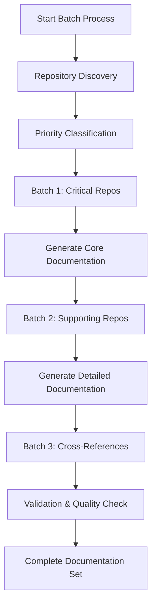
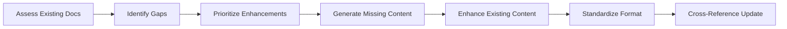

# Workflow Automation for Multi-Repository Documentation

> **Advanced techniques for streamlining documentation generation and maintenance**

## 🎯 Overview

This guide provides advanced automation workflows that leverage GitHub Copilot's latest features to minimize manual intervention and maintain high-quality documentation across multiple repositories.

## 🚀 Automation Strategies

### Strategy 1: Batch Processing Workflow

**Best for**: Large workspaces (5+ repositories)



#### Implementation

1. **Discovery Phase**:
```
@workspace Execute repository discovery and create processing batches based on:
- Repository size and complexity
- Inter-repository dependencies
- Business criticality
- Documentation priority

Create a processing plan with 3-4 batches, starting with the most critical repositories.
```

2. **Batch Processing**:
```
@workspace Process Batch [X]: Focus on repositories [list]. For each repository:
1. Generate core documentation (README, architecture)
2. Create API documentation if applicable
3. Document deployment and operational procedures
4. Establish cross-references to other batch repositories

Use multi-file editing to process multiple repositories simultaneously.
```

### Strategy 2: Incremental Enhancement Workflow

**Best for**: Existing projects with some documentation



#### Implementation

```
@workspace Analyze existing documentation and create an enhancement plan:

1. **Gap Analysis**: Identify missing documentation for each repository
2. **Quality Assessment**: Evaluate existing documentation quality
3. **Standardization Needs**: Find inconsistencies in format and style
4. **Enhancement Priorities**: Rank improvements by impact and effort

Then systematically enhance documentation using multi-file editing, focusing on the highest-impact improvements first.
```

### Strategy 3: Template-Driven Generation

**Best for**: Standardized environments with similar repository structures

#### Create Documentation Templates

```
@workspace Create standardized documentation templates for this project:

1. **Repository README Template**: Standard structure for all repository READMEs
2. **API Documentation Template**: Consistent API documentation format
3. **Architecture Documentation Template**: Standard architecture documentation
4. **Deployment Guide Template**: Consistent deployment documentation

Base templates on the most comprehensive existing documentation and project standards.
```

#### Apply Templates

```
@workspace Apply documentation templates to all repositories:

1. Use the created templates to generate consistent documentation
2. Customize template content based on each repository's specific characteristics
3. Ensure all generated documentation follows the established patterns
4. Maintain template compliance while adding repository-specific details

Use multi-file editing to apply templates across multiple repositories simultaneously.
```

## 🔄 Continuous Documentation Workflows

### Automated Update Detection

```
@workspace Create a documentation maintenance workflow:

1. **Change Detection**: Identify repositories with recent code changes
2. **Impact Analysis**: Determine which documentation sections might be affected
3. **Update Recommendations**: Suggest specific documentation updates needed
4. **Automated Updates**: Generate updated documentation for changed components

Focus on maintaining accuracy between code and documentation.
```

### Version Synchronization

```
@workspace Implement version synchronization for documentation:

1. **Version Tracking**: Document current versions of all repositories
2. **Compatibility Matrix**: Show version compatibility between repositories
3. **Update Coordination**: Plan coordinated updates across multiple repositories
4. **Breaking Change Documentation**: Document breaking changes and migration paths

Ensure documentation reflects the current state of all repositories.
```

## 🤖 Working with Copilot's Iterative Nature

### Understanding Copilot Limitations
GitHub Copilot typically works in small iterations and may not complete large tasks in one go. Our solution addresses this with:

#### 1. **Checkpoint-Based Workflows**
```
# Phase 1: Discovery
@workspace Analyze workspace structure and create repository inventory

# Phase 2: Individual Documentation (per repo)
@workspace Focus on [repo_name] only - create comprehensive documentation

# Phase 3: Cross-Reference Building
@workspace Update all documentation with cross-repository links

# Phase 4: Main Summary
@workspace Create main project.md summarizing all repositories
```

#### 2. **Resumable Task Patterns**
```
# If Copilot stops mid-task:
@workspace Continue documentation generation from where we left off for [specific_repo]

# Progress tracking:
@workspace Show current documentation completion status across all repositories

# Recovery prompts:
@workspace Resume multi-file editing session for documentation updates
```

#### 3. **Incremental Enhancement Strategy**
```
# Round 1: Basic structure
@workspace Create basic README.md files for all repositories

# Round 2: Content enhancement
@workspace Enhance existing documentation with detailed sections

# Round 3: Cross-linking
@workspace Add cross-repository references and integration details

# Round 4: Validation
@workspace Review and improve documentation quality
```

## 🎛️ Advanced Automation Techniques

### Multi-File Edit Optimization

#### Technique 1: Contextual File Grouping

```
@workspace Group related files for efficient multi-file editing:

1. **Architecture Group**: All architecture.md files across repositories
2. **API Group**: All API documentation files
3. **Deployment Group**: All deployment-related documentation
4. **README Group**: All repository README files

Process each group simultaneously to maintain consistency and cross-references.
```

#### Technique 2: Progressive Enhancement

```
@workspace Use progressive enhancement for documentation generation:

1. **Pass 1**: Generate basic structure and core content
2. **Pass 2**: Add detailed technical information and examples
3. **Pass 3**: Enhance with diagrams, cross-references, and advanced content
4. **Pass 4**: Polish formatting, add navigation, and final quality checks

Each pass builds upon the previous one, allowing for iterative improvement.
```

### Intelligent Content Generation

#### Code-Driven Documentation

```
@workspace Generate documentation directly from code analysis:

1. **API Documentation**: Extract API endpoints, parameters, and responses from code
2. **Configuration Documentation**: Document configuration options from config files
3. **Dependency Documentation**: Generate dependency information from package files
4. **Architecture Documentation**: Infer architecture from code structure and patterns

Ensure documentation accurately reflects the actual implementation.
```

#### Pattern Recognition

```
@workspace Use pattern recognition for consistent documentation:

1. **Identify Common Patterns**: Find recurring patterns across repositories
2. **Standardize Documentation**: Apply consistent documentation for similar patterns
3. **Template Generation**: Create templates based on identified patterns
4. **Automated Application**: Apply templates to repositories with similar patterns

This ensures consistency while reducing manual effort.
```

## 🔧 Workflow Customization

### For Different Project Types

#### Microservices Projects

```
@workspace Customize workflow for microservices architecture:

1. **Service Discovery Documentation**: Document service registry and discovery
2. **Inter-Service Communication**: Document APIs, message queues, and protocols
3. **Distributed Tracing**: Document request flow across services
4. **Service Mesh Documentation**: Document service mesh configuration and policies
5. **Deployment Orchestration**: Document container orchestration and scaling

Focus on service interactions and distributed system concerns.
```

#### Monorepo Projects

```
@workspace Customize workflow for monorepo structure:

1. **Module Documentation**: Document each module/package within the monorepo
2. **Shared Dependencies**: Document shared libraries and utilities
3. **Build System Documentation**: Document build processes and dependencies
4. **Module Interaction**: Document how modules interact and depend on each other
5. **Development Workflow**: Document development processes specific to monorepo

Emphasize module boundaries and shared components.
```

#### Full-Stack Applications

```
@workspace Customize workflow for full-stack applications:

1. **Frontend Documentation**: Document UI components, state management, and user flows
2. **Backend Documentation**: Document APIs, business logic, and data models
3. **Database Documentation**: Document schema, migrations, and data access patterns
4. **Integration Documentation**: Document frontend-backend integration
5. **End-to-End Workflows**: Document complete user journeys through the system

Focus on the complete user experience and data flow.
```

## 📊 Quality Assurance Automation

### Automated Validation Workflows

```
@workspace Create automated validation for generated documentation:

1. **Completeness Check**: Verify all required sections are present
2. **Accuracy Validation**: Check that technical details match the codebase
3. **Consistency Verification**: Ensure consistent formatting and terminology
4. **Link Validation**: Verify all cross-references and external links work
5. **Content Quality**: Assess clarity, usefulness, and actionability

Generate a quality report with specific improvement recommendations.
```

### Continuous Improvement

```
@workspace Implement continuous improvement for documentation:

1. **Usage Analytics**: Track which documentation is most/least accessed
2. **Feedback Integration**: Incorporate user feedback into documentation updates
3. **Gap Identification**: Continuously identify documentation gaps
4. **Quality Metrics**: Establish and track documentation quality metrics
5. **Automated Suggestions**: Generate suggestions for documentation improvements

Create a feedback loop for ongoing documentation enhancement.
```

## 🎯 Performance Optimization

### Large Workspace Optimization

#### Memory Management

```json
// Optimize VS Code settings for large workspaces
{
    "files.watcherExclude": {
        "**/node_modules/**": true,
        "**/.git/**": true,
        "**/dist/**": true,
        "**/build/**": true,
        "**/.next/**": true,
        "**/coverage/**": true
    },
    "search.exclude": {
        "**/node_modules": true,
        "**/dist": true,
        "**/build": true,
        "**/.next": true,
        "**/coverage": true
    },
    "github.copilot.advanced.length": 8000,
    "github.copilot.advanced.inlineSuggestCount": 3
}
```

#### Processing Strategies

1. **Selective Processing**: Focus on changed repositories only
2. **Parallel Processing**: Use multiple Copilot sessions for different repository groups
3. **Incremental Updates**: Update documentation incrementally rather than regenerating
4. **Caching Strategies**: Cache analysis results for unchanged repositories

### Context Management

```
@workspace Optimize context management for large projects:

1. **Context Prioritization**: Focus on the most relevant repositories for each task
2. **Selective Inclusion**: Include only necessary files in the context
3. **Context Rotation**: Rotate focus between different repository groups
4. **Hierarchical Processing**: Process at different levels of detail as needed

This ensures efficient use of Copilot's context window while maintaining quality.
```

## 🔄 Maintenance Workflows

### Regular Maintenance Schedule

#### Weekly Maintenance

```
@workspace Perform weekly documentation maintenance:

1. **Change Detection**: Identify repositories with recent commits
2. **Quick Updates**: Update documentation for minor changes
3. **Link Validation**: Check and fix broken internal links
4. **Content Freshness**: Update time-sensitive information

Focus on keeping documentation current with recent changes.
```

#### Monthly Comprehensive Review

```
@workspace Perform monthly comprehensive documentation review:

1. **Complete Accuracy Check**: Verify all technical details are current
2. **Structure Optimization**: Improve documentation organization
3. **Content Enhancement**: Add missing details and examples
4. **Cross-Reference Updates**: Update all inter-repository references
5. **Quality Improvements**: Enhance clarity and usefulness

Generate a comprehensive improvement plan and implement systematically.
```

### Automated Maintenance Triggers

```
@workspace Set up automated maintenance triggers:

1. **Code Change Triggers**: Automatically update documentation when code changes
2. **Dependency Updates**: Update documentation when dependencies change
3. **Release Triggers**: Update documentation for new releases
4. **Schedule Triggers**: Regular maintenance on a fixed schedule

Create a maintenance workflow that responds to project changes automatically.
```

## 📈 Success Metrics

### Documentation Quality Metrics

- **Completeness**: Percentage of repositories with complete documentation
- **Accuracy**: Percentage of documentation that matches current code
- **Consistency**: Adherence to documentation standards across repositories
- **Usability**: User feedback and documentation usage statistics
- **Maintenance**: Frequency of documentation updates and improvements

### Automation Efficiency Metrics

- **Time Savings**: Reduction in manual documentation effort
- **Coverage Increase**: Improvement in documentation coverage
- **Quality Improvement**: Enhancement in documentation quality scores
- **Maintenance Reduction**: Decrease in manual maintenance effort
- **User Satisfaction**: Improvement in developer experience with documentation

---

**Next Step**: [Validation Checklist →](./validation_checklist.md)