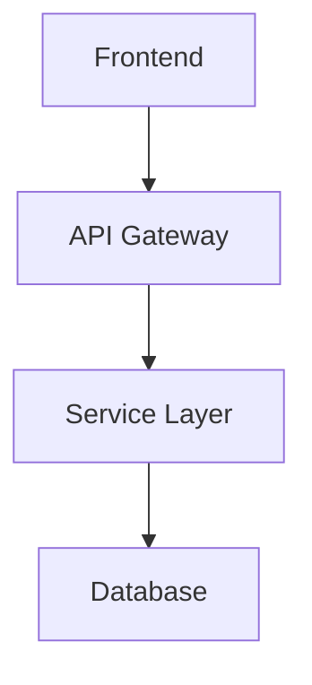
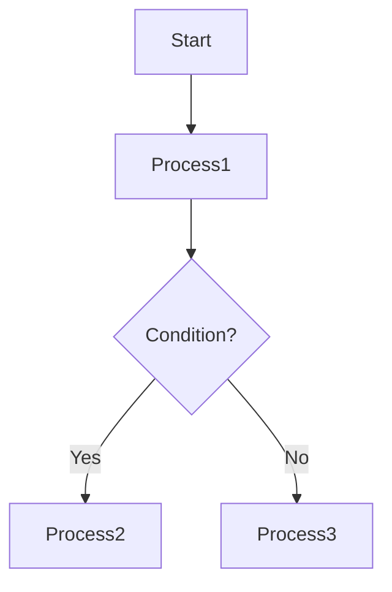
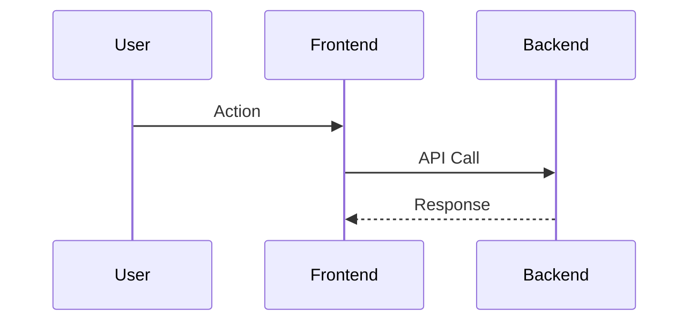

# Comprehensive GitHub Project Analysis and Workflow Mapping Prompt

## Overview
This prompt is designed to help LLMs perform deep analysis of complex GitHub projects, create comprehensive workflow documentation, and identify optimization opportunities.

## Primary Objectives
1. **High-Level Architecture Mapping**: Understand the overall system design and component relationships
2. **Detailed Workflow Documentation**: Map execution flows from entry points to individual scripts
3. **Visual Documentation Generation**: Create clear markdown documentation with flow diagrams
4. **Code Quality Analysis**: Identify redundancies, asymmetries, and optimization opportunities
5. **Knowledge Transfer**: Enable new developers to quickly understand the existing codebase

---

## Main Analysis Prompt

```
You are an expert software architect and code analyst. Your task is to perform a comprehensive analysis of this GitHub project to create detailed documentation that will help development teams understand, clean, and enhance the existing codebase.

### ANALYSIS FRAMEWORK

#### Phase 1: Project Structure Discovery
1. **Repository Overview**
   - Analyze the root directory structure
   - Identify main entry points (main.py, index.js, app.py, etc.)
   - Catalog configuration files (package.json, requirements.txt, Dockerfile, etc.)
   - Document build and deployment scripts
   - Map testing frameworks and test directories

2. **Technology Stack Identification**
   - Programming languages and versions
   - Frameworks and libraries used
   - Database systems and data storage
   - External APIs and services
   - Development and deployment tools
   - **DevOps and Infrastructure**: Ansible playbooks, Jenkins pipelines, CI/CD tools
   - **Infrastructure-as-Code**: Terraform, CloudFormation, Kubernetes manifests
   - **Containerization**: Docker, Podman, container orchestration

#### Phase 2: Architecture Analysis
1. **System Architecture**
   - Identify architectural patterns (MVC, microservices, monolith, etc.)
   - Map major components and their responsibilities
   - Document data flow between components
   - Identify external dependencies and integrations
   - **Infrastructure Architecture**: Multi-tier, cloud-native, hybrid patterns
   - **Automation Patterns**: Pipeline-as-code, infrastructure-as-code
   - **DevOps Structure**: Playbook organization, role hierarchies, pipeline stages
   - **Environment Management**: Dev/staging/prod configurations, variable management

2. **Module Dependency Mapping**
   - Create dependency graphs for major modules
   - Identify circular dependencies
   - Map import/export relationships
   - Document API contracts between modules

#### Phase 3: Workflow Analysis
1. **Execution Flow Mapping**
   - Trace main application workflows from start to finish
   - Document user interaction flows
   - Map background processes and scheduled tasks
   - Identify error handling and recovery mechanisms

2. **Script-Level Analysis**
   - Analyze individual script purposes and functions
   - Document input/output for each major function
   - Map script interdependencies
   - Identify utility scripts and their usage

#### Phase 4: Code Quality Assessment
1. **Redundancy Detection**
   - Identify duplicate code blocks
   - Find similar functions with minor variations
   - Locate redundant configuration or setup code
   - Spot unnecessary file duplications

2. **Asymmetry Analysis**
   - Compare similar modules for consistency
   - Identify inconsistent naming conventions
   - Find mismatched error handling patterns
   - Spot inconsistent coding styles

3. **Optimization Opportunities**
   - Identify unused files and dead code
   - Find overly complex functions that could be simplified
   - Spot performance bottlenecks
   - Identify security vulnerabilities

### OUTPUT REQUIREMENTS

#### 1. Executive Summary Document
Create a high-level overview including:
- Project purpose and main functionality
- Technology stack summary
- Architecture overview
- Key findings and recommendations

#### 2. Detailed Architecture Documentation
Generate comprehensive documentation with:
- System architecture diagrams (using Mermaid syntax)
- Component interaction flows
- Data flow diagrams
- Dependency maps

#### 3. Workflow Documentation
Create detailed workflow maps including:
- User journey flowcharts
- Process execution flows
- Error handling workflows
- Background task sequences

#### 4. Code Quality Report
Provide analysis including:
- Redundancy identification with specific examples
- Asymmetry analysis with recommendations
- Optimization opportunities ranked by impact
- Refactoring suggestions with priority levels

#### 5. Developer Onboarding Guide
Create documentation to help new developers:
- Quick start guide
- Development environment setup
- Key concepts and terminology
- Common development workflows
- Testing and debugging procedures

### MERMAID DIAGRAM REQUIREMENTS

Use Mermaid syntax for all diagrams. Include:

1. **System Architecture Diagram**


2. **Workflow Diagrams**


3. **Sequence Diagrams**


### ANALYSIS METHODOLOGY

1. **Start with Entry Points**: Begin analysis from main application entry points
2. **Follow the Data**: Trace how data flows through the system
3. **Map Dependencies**: Create comprehensive dependency maps
4. **Identify Patterns**: Look for recurring patterns and anti-patterns
5. **Document Everything**: Create clear, actionable documentation

### QUALITY CRITERIA

- **Completeness**: Cover all major components and workflows
- **Clarity**: Use clear, non-technical language where possible
- **Actionability**: Provide specific, implementable recommendations
- **Visual Appeal**: Include comprehensive diagrams and flowcharts
- **Maintainability**: Create documentation that can be easily updated

Analyze the provided GitHub repository following this framework and generate comprehensive documentation that will serve as a foundation for the team's "learn, clean, clear, refine, then enhance" pathway.
```

---

## Usage Instructions

1. **Preparation**: Ensure you have access to the complete GitHub repository
2. **Context Setting**: Provide the LLM with repository structure and key files
3. **Iterative Analysis**: Use this prompt in phases, focusing on one section at a time for large projects
4. **Validation**: Review generated documentation with domain experts
5. **Maintenance**: Update documentation as the codebase evolves

## Expected Outputs

- **Executive Summary**: 2-3 page overview
- **Architecture Documentation**: 10-15 pages with diagrams
- **Workflow Documentation**: 5-10 pages with flowcharts
- **Code Quality Report**: 5-8 pages with specific recommendations
- **Developer Guide**: 3-5 pages for onboarding

## Success Metrics

- New developers can understand the system within 2-3 days
- 80% reduction in "how does this work?" questions
- Clear roadmap for code improvements and refactoring
- Comprehensive visual documentation for all major workflows