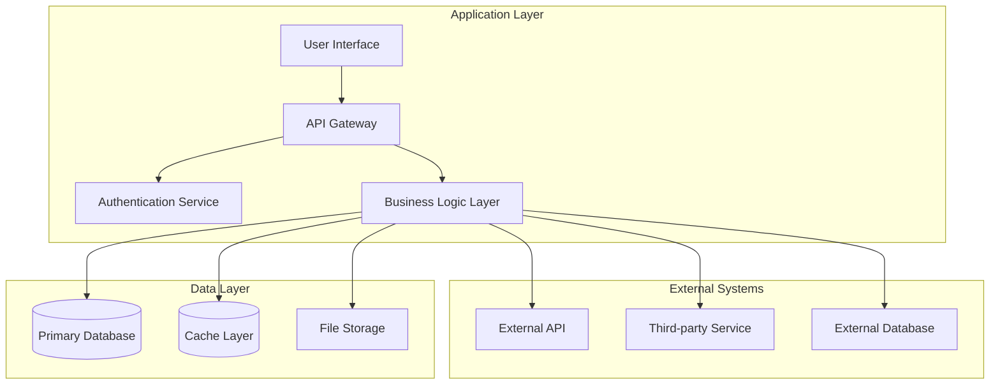
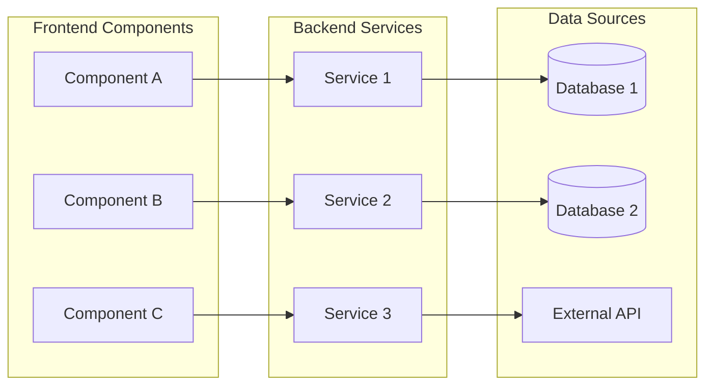
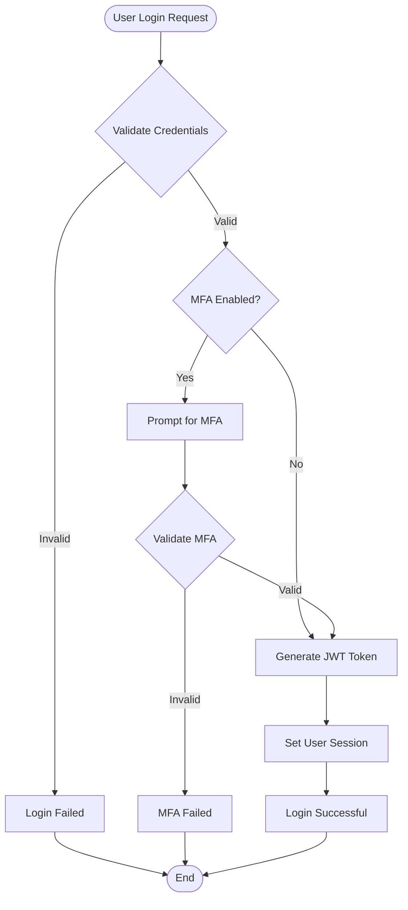
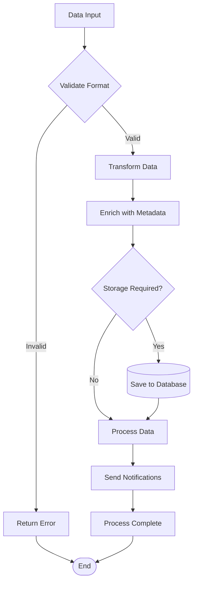
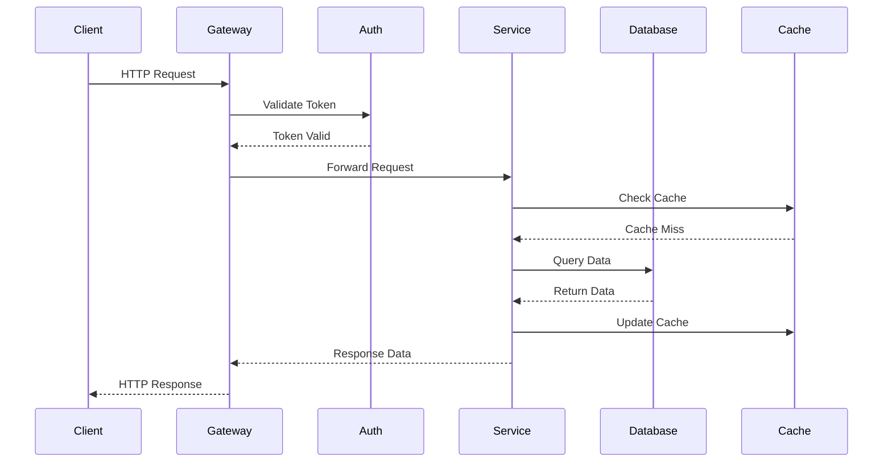
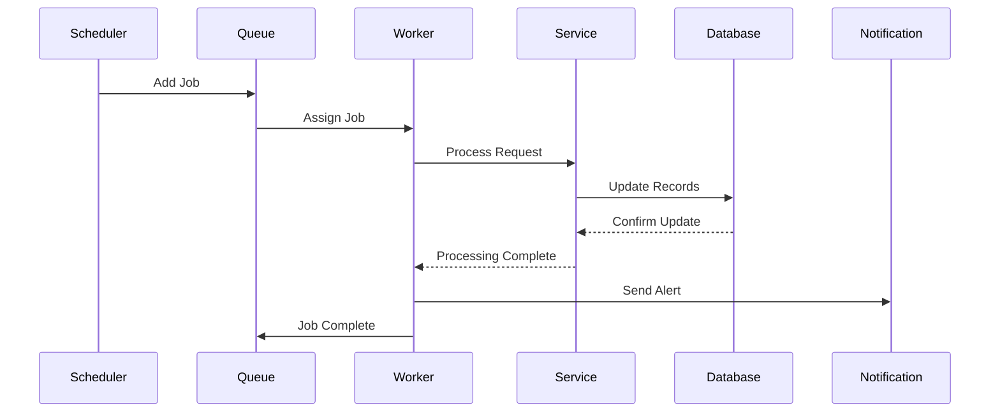
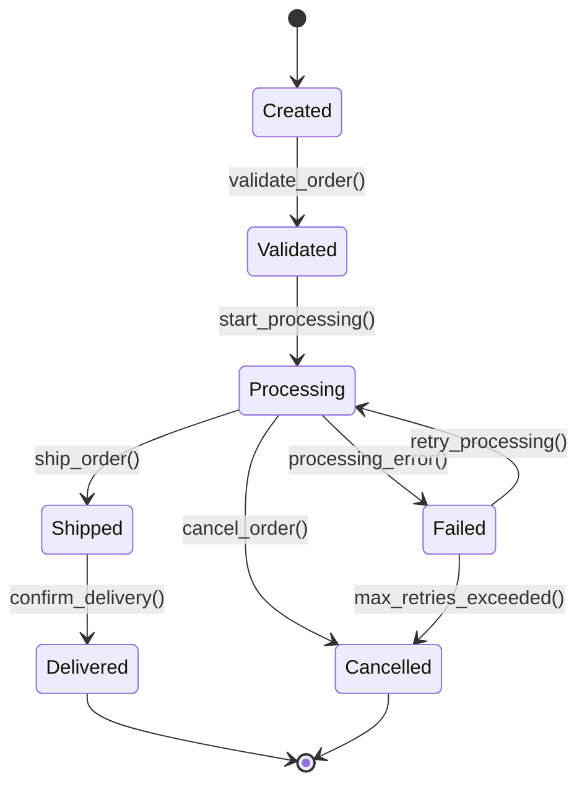

# Advanced Workflow Mapping and Visual Documentation Prompt

## Purpose
This specialized prompt focuses on creating comprehensive workflow maps, process flows, and visual documentation using modern diagramming techniques and markdown integration.

---

## Workflow Mapping and Visualization Prompt

```
You are an expert systems analyst and technical documentation specialist. Your task is to create comprehensive workflow maps and visual documentation for complex software projects, making them easily understandable for developers at all levels.

### WORKFLOW ANALYSIS FRAMEWORK

#### 1. System Entry Point Analysis

**Application Entry Points**
- Main application startup sequences
- API endpoint entry points
- Background job and scheduled task entry points
- Event-driven process triggers
- User interface interaction points

**DevOps Entry Points**
- Ansible: Playbook execution points, role entry tasks
- Jenkins: Pipeline triggers, webhook endpoints, scheduled jobs
- CI/CD: Git hooks, merge triggers, deployment triggers
- Infrastructure: Terraform apply points, CloudFormation stack creation
- Monitoring: Alert triggers, health check endpoints
- Shell Scripts: Script execution points, cron job triggers, system startup scripts

**Data Entry Points**
- Database connection and initialization
- File system interactions
- External API integrations
- Message queue consumers
- Configuration loading processes
- **DevOps Interactions**: Manual deployments, infrastructure changes, pipeline approvals

#### 2. Process Flow Mapping

**User Journey Workflows**
- Authentication and authorization flows
- Core business process workflows
- Error handling and recovery paths
- Data validation and processing flows
- Notification and communication workflows

**DevOps Process Flows**
- CI/CD Pipelines: Build → Test → Deploy → Monitor workflows
- Infrastructure Provisioning: Plan → Apply → Validate → Monitor
- Shell Script Workflows: Initialization → Processing → Validation → Cleanup
- Environment Setup: Variable loading → Service configuration → Health checks
- Configuration Management: Inventory → Playbook → Execution → Verification
- Deployment Strategies: Blue-green, canary, rolling deployments
- Incident Response: Detection → Alert → Response → Resolution

**System Internal Workflows**
- Service-to-service communication
- Database transaction flows
- Cache management processes
- Background processing workflows
- Monitoring and logging flows
- Automation Flows: Scheduled tasks, event-driven automation, self-healing processes

#### 3. Data Flow Analysis

**Data Transformation Pipelines**
- Input data validation and sanitization
- Business logic processing steps
- Data enrichment and aggregation
- Output formatting and delivery
- Error handling and rollback procedures

**DevOps Data Flows**
- Configuration Data: Variable propagation, secret management, environment-specific configs
- Artifact Flow: Build artifacts, container images, deployment packages
- Monitoring Data: Metrics collection, log aggregation, alert propagation
- State Management: Infrastructure state, deployment state, configuration drift
- Backup and Recovery: Data backup flows, disaster recovery procedures
- Shell Script Data: Environment variable propagation, file system operations, process communication

**State Management Flows**
- Application state transitions
- Session management workflows
- Transaction state handling
- Cache invalidation processes
- Persistence layer interactions
- Infrastructure State: Terraform state, Ansible facts, inventory management
- Script State: Variable persistence, temporary file management, execution context

### VISUALIZATION REQUIREMENTS

#### 1. High-Level Architecture Diagrams

**System Overview Diagram**


**Component Interaction Diagram**


#### 2. Detailed Process Flow Diagrams

**User Authentication Flow**


**Data Processing Workflow**


#### 3. Sequence Diagrams for Complex Interactions

**API Request Processing**


**Background Job Processing**


#### 4. State Transition Diagrams

**Order Processing States**


### DOCUMENTATION STRUCTURE

#### 1. Executive Workflow Summary

**Overview Section**
```markdown
# System Workflow Overview

## Key Processes
1. **User Management**: Authentication, authorization, profile management
2. **Core Business Logic**: [Primary business processes]
3. **Data Processing**: Input validation, transformation, storage
4. **Integration Workflows**: External API interactions, third-party services
5. **Background Operations**: Scheduled tasks, cleanup processes

## Critical Paths
- **Happy Path**: Normal user journey from start to completion
- **Error Paths**: Exception handling and recovery procedures
- **Edge Cases**: Unusual scenarios and their handling
```

#### 2. Detailed Process Documentation

For each major workflow:
```markdown
## [Workflow Name]

### Purpose
[Brief description of what this workflow accomplishes]

### Triggers
- [What initiates this workflow]
- [Conditions that must be met]

### Prerequisites
- [Required system state]
- [Dependencies that must be available]

### Process Steps
1. **Step 1**: [Detailed description]
   - Input: [What data/state is required]
   - Processing: [What happens in this step]
   - Output: [What is produced]
   - Error Handling: [How errors are managed]

2. **Step 2**: [Continue for each step]

### Success Criteria
- [How to determine successful completion]
- [Expected outcomes]

### Failure Scenarios
- [Common failure points]
- [Recovery procedures]

### Performance Considerations
- [Expected processing time]
- [Resource requirements]
- [Scalability factors]
```

#### 3. Integration Point Documentation

**External Service Interactions**
```markdown
## External Integrations

### [Service Name]
- **Purpose**: [Why this integration exists]
- **Protocol**: [HTTP REST, GraphQL, gRPC, etc.]
- **Authentication**: [How authentication is handled]
- **Rate Limits**: [Any limitations to be aware of]
- **Error Handling**: [How failures are managed]
- **Fallback Strategy**: [What happens if service is unavailable]

#### Request Flow
[Mermaid diagram showing the request/response flow]

#### Data Mapping
| Internal Field | External Field | Transformation |
|----------------|----------------|----------------|
| [field1]       | [ext_field1]   | [any mapping]  |
```

### ANALYSIS METHODOLOGY

#### Step 1: Code Flow Tracing
```
1. Identify all entry points (main functions, API endpoints, event handlers)
2. Trace execution paths from each entry point
3. Map function call hierarchies and dependencies
4. Document data transformations at each step
5. Identify decision points and branching logic
```

#### Step 2: Data Flow Analysis
```
1. Map data sources and destinations
2. Trace data transformations through the system
3. Identify data validation and sanitization points
4. Document data persistence and retrieval patterns
5. Map data sharing between components
```

#### Step 3: Integration Point Mapping
```
1. Identify all external system interactions
2. Document API contracts and data formats
3. Map authentication and authorization flows
4. Identify error handling and retry mechanisms
5. Document fallback and circuit breaker patterns
```

#### Step 4: State Management Analysis
```
1. Identify stateful components and their lifecycles
2. Map state transitions and triggers
3. Document state persistence mechanisms
4. Identify state synchronization points
5. Map state cleanup and garbage collection
```

### QUALITY CRITERIA

#### Completeness Checklist
- [ ] All major workflows documented
- [ ] All integration points mapped
- [ ] Error handling paths included
- [ ] Performance considerations noted
- [ ] Security aspects documented
- [ ] Monitoring and logging points identified

#### Clarity Standards
- **Visual Consistency**: All diagrams follow the same style and notation
- **Logical Flow**: Processes flow logically from start to finish
- **Appropriate Detail**: Right level of detail for the target audience
- **Clear Labeling**: All components and processes clearly labeled
- **Legend Provided**: Explanation of symbols and conventions used

### OUTPUT DELIVERABLES

#### 1. Workflow Documentation Package
```
📁 workflow_documentation/
├── 📄 00_executive_summary.md
├── 📄 01_system_overview.md
├── 📄 02_user_workflows.md
├── 📄 03_system_workflows.md
├── 📄 04_integration_flows.md
├── 📄 05_error_handling.md
├── 📄 06_performance_considerations.md
└── 📁 diagrams/
    ├── 🖼️ system_architecture.mmd
    ├── 🖼️ user_flows.mmd
    ├── 🖼️ data_flows.mmd
    └── 🖼️ integration_diagrams.mmd
```

#### 2. Interactive Documentation
- **Clickable Diagrams**: Links between related workflows
- **Searchable Content**: Easy navigation and discovery
- **Version Control**: Track changes and updates
- **Collaborative Features**: Comments and suggestions

Analyze the provided codebase and create comprehensive workflow documentation following this framework. Focus on creating clear, actionable documentation that will help developers understand and work with the existing system effectively.
```

---

## Implementation Best Practices

### For Complex Systems
1. **Layered Approach**: Start with high-level flows, then drill down
2. **Modular Documentation**: Create separate documents for different subsystems
3. **Cross-References**: Link related workflows and components
4. **Regular Updates**: Keep documentation synchronized with code changes

### For Team Collaboration
1. **Standardized Notation**: Use consistent symbols and conventions
2. **Review Process**: Have domain experts validate the workflows
3. **Accessibility**: Ensure documentation is accessible to all team members
4. **Training Materials**: Create guides for reading and updating the documentation

### Success Metrics
- **Reduced Onboarding Time**: New developers understand workflows faster
- **Fewer Clarification Questions**: Self-service documentation reduces interruptions
- **Improved Debugging**: Clear workflows help identify issues faster
- **Better Planning**: Visual workflows improve feature planning and estimation