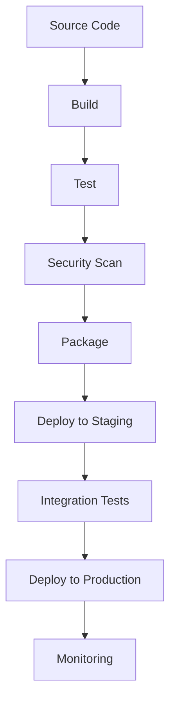

# DevOps & CI/CD Repository Analysis Prompt

## Overview
This prompt is specifically designed for analyzing DevOps repositories containing Ansible playbooks, Jenkins pipelines, CI/CD configurations, and infrastructure-as-code (IaC) components. It provides comprehensive analysis of automation workflows, deployment strategies, and infrastructure management practices.

## Analysis Framework

### 1. Repository Type Detection

**Identify Repository Characteristics:**
- Ansible Repository: Look for `playbooks/`, `roles/`, `inventory/`, `ansible.cfg`, `requirements.yml`
- Jenkins Repository: Look for `Jenkinsfile`, `jenkins/`, `pipelines/`, `.jenkins/`
- Mixed DevOps Repository: Combination of multiple tools and configurations
- Infrastructure Repository: Terraform, CloudFormation, Kubernetes manifests
- CI/CD Repository: GitHub Actions, GitLab CI, Azure DevOps, CircleCI configurations
- Shell Script Repository: Look for `.sh`, `.ps1`, `.bat`, `scripts/`, deployment automation
- Environment Management: Configuration scripts, setup automation, system initialization

### 2. Ansible-Specific Analysis

**Playbook Structure Analysis:**
```yaml
# Analyze playbook organization
- Playbook naming conventions and structure
- Role dependencies and relationships
- Variable management (group_vars, host_vars)
- Inventory organization and patterns
- Task complexity and reusability
- Shell script integration and execution
- Environment variable management
```

**Best Practices Assessment:**
- Idempotency verification
- Error handling and rollback strategies
- Security practices (vault usage, privilege escalation)
- Performance optimization (parallel execution, fact caching)
- Documentation and commenting standards

**Common Issues Detection:**
- Hardcoded values and secrets
- Missing error handling
- Inefficient task ordering
- Deprecated module usage
- Inconsistent variable naming

### 3. Jenkins Pipeline Analysis

**Pipeline Structure Evaluation:**
```groovy
// Analyze Jenkins pipeline patterns
- Declarative vs Scripted pipeline usage
- Stage organization and dependencies
- Parallel execution strategies
- Error handling and notifications
- Artifact management
- Shell script execution and integration
- Environment variable propagation
- File system operations and permissions
```

**CI/CD Best Practices:**
- Build optimization and caching
- Test automation integration
- Deployment strategies (blue-green, canary)
- Security scanning integration
- Environment promotion workflows

**Pipeline Quality Assessment:**
- Code duplication across pipelines
- Shared library utilization
- Resource management and cleanup
- Monitoring and alerting integration
- Compliance and audit trails

### 4. Infrastructure-as-Code Analysis

**Configuration Management:**
- Resource organization and modularity
- State management practices
- Version control integration
- Environment-specific configurations
- Dependency management

**Security and Compliance:**
- Secret management practices
- Access control and permissions
- Compliance policy enforcement
- Audit logging and monitoring
- Backup and disaster recovery

### 5. CI/CD Workflow Mapping

**Pipeline Visualization:**


**Workflow Analysis:**
- Trigger mechanisms and conditions
- Approval processes and gates
- Rollback and recovery procedures
- Monitoring and alerting integration
- Performance metrics and optimization

### 6. Shell Script Analysis

**Script Structure Assessment:**
```bash
# Analyze shell script organization
- Script naming conventions and structure
- Function definitions and reusability
- Variable management and scope
- Error handling and exit codes
- Documentation and commenting standards
```

**Best Practices Evaluation:**
- Input validation and sanitization
- Error handling and logging
- Security practices (privilege management, secret handling)
- Performance optimization (command efficiency, subprocess management)
- Portability and compatibility (cross-platform considerations)

**Common Issues Detection:**
- Hardcoded paths and configurations
- Missing error handling and validation
- Insecure operations and privilege escalation
- Inefficient command usage and resource management
- Inconsistent coding standards and documentation

**Environment Integration:**
- Environment variable usage and propagation
- File system operations and permissions
- Process management and signal handling
- System dependency management
- Configuration file interactions

### 7. Multi-Tool Integration Assessment

**Tool Chain Analysis:**
- Integration points between tools
- Data flow and artifact passing
- Configuration consistency
- Shared resource management
- Cross-tool dependency mapping
- Shell script integration across tools

**Optimization Opportunities:**
- Workflow consolidation possibilities
- Redundancy elimination
- Performance bottleneck identification
- Resource utilization optimization
- Maintenance overhead reduction
- Shell script standardization and reuse

## Advanced Analysis Techniques

### 1. Dependency Graph Analysis

**Infrastructure Dependencies:**
- Service interdependencies
- Resource allocation patterns
- Network topology mapping
- Data flow analysis
- Failure impact assessment

### 2. Security Analysis

**DevOps Security Assessment:**
- Secret management audit
- Access control review
- Pipeline security scanning
- Compliance verification
- Vulnerability assessment

### 3. Performance Analysis

**Automation Performance:**
- Execution time analysis
- Resource utilization patterns
- Bottleneck identification
- Scalability assessment
- Optimization recommendations

## Output Requirements

### 1. Executive Summary

**Repository Overview:**
- Repository type and primary technologies
- Overall architecture assessment
- Key strengths and critical issues
- Compliance and security status
- Recommended priority actions

### 2. Detailed Technical Analysis

**Infrastructure Analysis:**
```markdown
## Infrastructure Architecture

### Current State
- [Detailed infrastructure description]
- [Technology stack analysis]
- [Resource allocation review]

### Identified Issues
- [Critical issues with impact assessment]
- [Security vulnerabilities]
- [Performance bottlenecks]

### Recommendations
- [Prioritized improvement suggestions]
- [Best practice implementations]
- [Optimization opportunities]
```

**Automation Workflow Documentation:**
```markdown
## CI/CD Pipeline Analysis

### Pipeline Overview
[Mermaid diagram of current pipeline]

### Stage Analysis
- **Build Stage**: [Analysis and recommendations]
- **Test Stage**: [Coverage and quality assessment]
- **Deploy Stage**: [Strategy and reliability review]

### Integration Points
- [Tool integration assessment]
- [Data flow analysis]
- [Dependency mapping]
```

### 3. Security and Compliance Report

**Security Assessment:**
- Secret management evaluation
- Access control audit
- Vulnerability scan results
- Compliance gap analysis
- Remediation roadmap

### 4. Performance and Optimization Report

**Performance Metrics:**
- Pipeline execution times
- Resource utilization analysis
- Bottleneck identification
- Scalability assessment
- Cost optimization opportunities

### 5. Improvement Roadmap

**Phase 1: Critical Issues (Week 1-2)**
- [ ] Security vulnerability remediation
- [ ] Critical pipeline failures resolution
- [ ] Essential documentation updates

**Phase 2: Optimization (Month 1-2)**
- [ ] Performance improvements
- [ ] Workflow consolidation
- [ ] Best practice implementation

**Phase 3: Enhancement (Month 2-6)**
- [ ] Advanced monitoring integration
- [ ] Automation expansion
- [ ] Team capability building

## DevOps-Specific Considerations

### 1. Multi-Environment Support

**Environment Management:**
- Development, staging, production configurations
- Environment-specific variable management
- Promotion workflow analysis
- Configuration drift detection
- Environment parity assessment

### 2. Monitoring and Observability

**Monitoring Integration:**
- Infrastructure monitoring setup
- Application performance monitoring
- Log aggregation and analysis
- Alerting and notification systems
- Dashboard and visualization tools

### 3. Disaster Recovery and Business Continuity

**Resilience Assessment:**
- Backup and recovery procedures
- Failover mechanisms
- Data protection strategies
- Business continuity planning
- Recovery time objectives (RTO) analysis

## Implementation Guidelines

### For Ansible Repositories
1. **Structure Analysis**: Evaluate role organization and playbook design
2. **Variable Management**: Review variable precedence and organization
3. **Security Review**: Audit vault usage and privilege escalation
4. **Performance Optimization**: Identify parallelization opportunities
5. **Documentation Enhancement**: Improve role and playbook documentation

### For Jenkins Repositories
1. **Pipeline Optimization**: Review stage organization and parallel execution
2. **Shared Library Utilization**: Identify code reuse opportunities
3. **Security Integration**: Enhance security scanning and compliance
4. **Monitoring Enhancement**: Improve pipeline observability
5. **Resource Management**: Optimize agent and resource utilization

### For Mixed DevOps Repositories
1. **Integration Assessment**: Evaluate tool chain effectiveness
2. **Workflow Optimization**: Streamline cross-tool processes
3. **Configuration Management**: Ensure consistency across tools
4. **Documentation Consolidation**: Create unified documentation
5. **Team Training**: Identify skill development needs

## Success Metrics

### Immediate Outcomes (Week 1-2)
- [ ] Complete infrastructure and pipeline documentation
- [ ] Critical security issues identified and prioritized
- [ ] Performance bottlenecks mapped and analyzed
- [ ] Compliance gaps documented with remediation plans

### Short-term Goals (Month 1-3)
- [ ] 50% reduction in pipeline failure rates
- [ ] 30% improvement in deployment frequency
- [ ] Security vulnerabilities remediated
- [ ] Monitoring and alerting fully operational

### Long-term Benefits (Month 3-12)
- [ ] 40% reduction in deployment time
- [ ] 60% improvement in mean time to recovery (MTTR)
- [ ] Full automation of manual processes
- [ ] Comprehensive disaster recovery capabilities
- [ ] Team autonomy in DevOps practices

## Tool Integration Recommendations

### Static Analysis Tools
- **Ansible**: ansible-lint, molecule for testing
- **Jenkins**: Pipeline linting, security scanning
- **Infrastructure**: tflint, checkov, terrascan
- **General**: SonarQube, SAST/DAST tools

### Monitoring and Observability
- **Infrastructure**: Prometheus, Grafana, Datadog
- **Applications**: APM tools, distributed tracing
- **Logs**: ELK stack, Splunk, CloudWatch
- **Alerts**: PagerDuty, Slack, email notifications

### Security Tools
- **Secret Management**: HashiCorp Vault, AWS Secrets Manager
- **Vulnerability Scanning**: Snyk, Aqua, Twistlock
- **Compliance**: Chef InSpec, AWS Config, Azure Policy
- **Access Control**: RBAC, LDAP integration, SSO

This prompt ensures comprehensive analysis of DevOps and CI/CD repositories while maintaining compatibility with general software development projects.