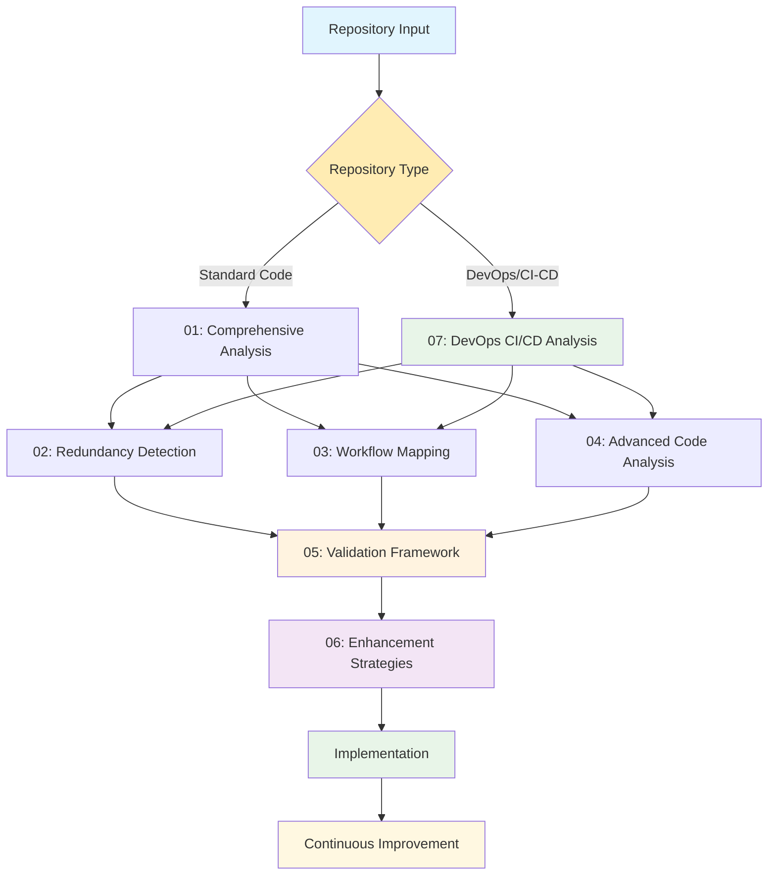
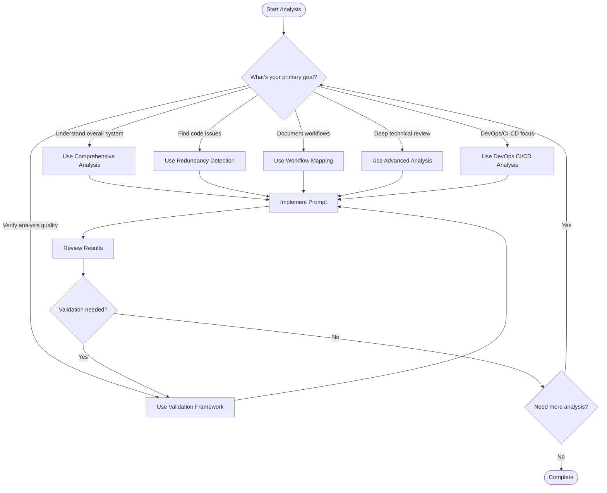

# LLM Project Analysis Prompts Collection

## Overview

This collection provides professional-grade LLM prompts designed to perform comprehensive analysis of complex GitHub projects. These prompts leverage cutting-edge techniques in code analysis, workflow mapping, and documentation generation to help development teams understand, clean, and enhance existing codebases.

## 🎯 Purpose

Support development teams in the **"Learn, Clean, Clear, Refine, then Enhance"** pathway by providing:

- **Deep Code Understanding**: Comprehensive analysis of project structure and workflows
- **Visual Documentation**: Clear diagrams and flowcharts for complex systems
- **Quality Assessment**: Identification of redundancies, asymmetries, and optimization opportunities
- **Actionable Insights**: Specific recommendations for improvement with priority rankings
- **Knowledge Transfer**: Documentation that enables rapid onboarding of new team members

## 📁 Prompt Collection

### 1. [Comprehensive Project Analysis](./01_comprehensive_project_analysis_prompt.md)
**Primary Use**: Overall project understanding and high-level documentation

**Key Features**:
- Complete project structure analysis
- Technology stack identification
- Architecture mapping with Mermaid diagrams
- Developer onboarding guide generation
- Executive summary creation
- DevOps infrastructure detection

**Best For**: Initial project assessment, new team member onboarding, stakeholder presentations

### 2. [Redundancy Detection and Optimization](./02_redundancy_detection_prompt.md)
**Primary Use**: Code quality improvement and technical debt reduction

**Key Features**:
- Advanced duplicate code detection
- Asymmetry analysis between similar modules
- Unnecessary file identification
- Optimization opportunity ranking
- Cleanup action plan with phases
- Ansible/Jenkins redundancy patterns

**Best For**: Code refactoring projects, technical debt reduction, performance optimization

### 3. [Workflow Mapping and Visualization](./03_workflow_mapping_visualization_prompt.md)
**Primary Use**: Process documentation and visual workflow creation

**Key Features**:
- Comprehensive workflow mapping
- Interactive Mermaid diagram generation
- Process flow documentation
- Integration point analysis
- State transition mapping
- CI/CD pipeline visualization

**Best For**: System documentation, process optimization, debugging complex workflows

### 4. [Advanced Code Analysis](./04_advanced_code_analysis_prompt.md)
**Primary Use**: Deep technical analysis and quality assessment

**Key Features**:
- Multi-layer code analysis (syntactic, semantic, architectural)
- Design pattern and anti-pattern detection
- Security vulnerability assessment
- Performance analysis and optimization
- Comprehensive quality metrics
- DevOps configuration analysis

**Best For**: Code reviews, security audits, performance optimization, architectural improvements

### 5. [Validation Framework](./05_validation_framework_prompt.md)
**Primary Use**: Quality assurance and result verification

**Key Features**:
- Comprehensive positive and negative validation checks
- Automated verification scripts and tools
- Expert review processes and checklists
- Implementation testing and success metrics
- Continuous improvement feedback loops
- DevOps validation criteria

**Best For**: Ensuring analysis accuracy, validating recommendations, maintaining quality standards

### 6. [Enhancement Strategies Guide](./06_enhancement_strategies_guide.md)
**Primary Use**: Advanced code quality and maintainability improvements

**Key Features**:
- Progressive enhancement methodologies
- Advanced refactoring patterns and techniques
- Performance optimization strategies
- Security-by-design principles
- Continuous improvement frameworks
- DevOps integration strategies

**Best For**: Long-term codebase evolution, team capability building, sustainable development practices

### 7. [DevOps CI/CD Analysis](./07_devops_cicd_analysis_prompt.md)
**Primary Use**: Specialized DevOps and CI/CD analysis

**Key Features**:
- Infrastructure-as-Code analysis
- Pipeline optimization
- Automation assessment
- Multi-tool integration
- Ansible playbook analysis
- Jenkins pipeline evaluation

**Best For**: Comprehensive analysis of Ansible, Jenkins, and CI/CD repositories

## 🚀 Quick Start Guide

### Step 1: Choose Your Analysis Type



### Step 2: Prepare Your Repository

1. **Ensure Complete Access**: Make sure you have full repository access
2. **Gather Context**: Collect any existing documentation or architectural notes
3. **Identify Repository Type**: Determine if it's a standard application, DevOps-focused, or mixed repository
4. **DevOps Considerations**: For Ansible/Jenkins repos, gather environment details and deployment contexts
5. **Identify Stakeholders**: Know who will use the generated documentation
6. **Set Scope**: Determine which parts of the codebase to analyze first

### Step 3: Execute the Analysis

1. **Select the appropriate prompt** based on repository type:
   - Standard applications: Start with Comprehensive Analysis
   - DevOps/CI-CD repositories: Start with DevOps CI/CD Analysis
   - Mixed repositories: Use both approaches
2. **Customize for your project** (language-specific considerations, focus areas, DevOps tools)
3. **Provide repository context** to your LLM, including infrastructure and deployment details
4. **Run the analysis** in phases for large projects
5. **Apply validation framework** to ensure quality and accuracy
6. **Review and validate** results with domain experts and DevOps teams
7. **Implement recommendations** incrementally with continuous monitoring



### Step 2: Prepare Your Repository

1. **Ensure Complete Access**: Make sure you have full repository access
2. **Gather Context**: Collect any existing documentation or architectural notes
3. **Identify Stakeholders**: Know who will use the generated documentation
4. **Set Scope**: Determine which parts of the codebase to analyze first

### Step 3: Execute the Analysis

1. **Copy the appropriate prompt** from the collection
2. **Customize for your project** (language-specific considerations, focus areas)
3. **Provide repository context** to your LLM
4. **Run the analysis** in phases for large projects
5. **Apply validation framework** to ensure quality and accuracy
6. **Review and validate** results with domain experts
7. **Implement recommendations** incrementally with continuous monitoring

## 📊 Implementation Strategies

### For Large Codebases (>100k lines)

**Incremental Approach**:
```
1. Start with high-level comprehensive analysis
2. Focus on critical modules first
3. Use redundancy detection on hotspots
4. Create workflow maps for core processes
5. Apply advanced analysis to key components
```

**Resource Management**:
- Process in logical chunks (by module, service, or feature)
- Use parallel analysis for independent components
- Prioritize based on business impact and technical risk

### For Medium Projects (10k-100k lines)

**Balanced Approach**:
```
1. Comprehensive analysis for overall understanding
2. Workflow mapping for key user journeys
3. Redundancy detection across the entire codebase
4. Advanced analysis for critical components
```

### For Small Projects (<10k lines)

**Complete Analysis**:
```
1. Run all prompts for comprehensive coverage
2. Focus on documentation and knowledge transfer
3. Emphasize future scalability considerations
```

## 🛠️ Customization Guidelines

### Language-Specific Adaptations

**Python Projects**:
```markdown
Add to prompts:
- PEP 8 compliance checking
- Virtual environment analysis
- Package dependency management
- Django/Flask specific patterns
- Async/await usage patterns
```

**JavaScript/Node.js Projects**:
```markdown
Add to prompts:
- ES6+ feature usage
- NPM dependency analysis
- React/Vue component patterns
- Async programming patterns
- Bundle size optimization
```

**Java Projects**:
```markdown
Add to prompts:
- Spring framework patterns
- Maven/Gradle dependency analysis
- Design pattern implementation
- JVM performance considerations
- Enterprise architecture patterns
```

### Domain-Specific Considerations

**Web Applications**:
- Focus on security vulnerabilities
- Analyze API design patterns
- Review authentication/authorization flows
- Assess scalability patterns

**Data Processing Systems**:
- Emphasize data flow analysis
- Review ETL pipeline patterns
- Analyze data validation and quality
- Assess performance and throughput

**Microservices**:
- Focus on service boundaries
- Analyze inter-service communication
- Review deployment and orchestration
- Assess monitoring and observability

## 📈 Success Metrics

### Immediate Outcomes (Week 1-2)
- [ ] Complete project documentation generated
- [ ] Critical issues identified and prioritized
- [ ] Development team understands system architecture
- [ ] Clear improvement roadmap established
- [ ] **Validation framework confirms >90% analysis accuracy**
- [ ] **Enhancement strategies selected and prioritized**

### Short-term Goals (Month 1-3)
- [ ] 50% reduction in "how does this work?" questions
- [ ] New developers productive within 3 days
- [ ] Critical redundancies and security issues addressed
- [ ] Improved code review efficiency
- [ ] **Validation checks pass consistently across all analyses**
- [ ] **Quality gates implemented and functioning**

### Long-term Benefits (Month 3-12)
- [ ] 30% reduction in bug fix time
- [ ] 25% improvement in feature delivery speed
- [ ] Measurable code quality improvements
- [ ] Enhanced system maintainability and scalability
- [ ] **Continuous validation ensures sustained quality improvements**
- [ ] **Team autonomously maintains and improves code quality**
- [ ] **Technical debt ratio maintained below 5%**

## 🔧 Tool Integration

### Recommended Static Analysis Tools

**Multi-Language**:
- SonarQube for comprehensive code quality
- CodeClimate for maintainability analysis
- Snyk for security vulnerability scanning

**Language-Specific**:
- **Python**: Pylint, Black, Bandit
- **JavaScript**: ESLint, Prettier, JSHint
- **Java**: SpotBugs, PMD, Checkstyle
- **C++**: Clang-tidy, Cppcheck

### Documentation Tools

**Diagram Generation**:
- Mermaid for flowcharts and diagrams
- PlantUML for UML diagrams
- Draw.io for complex architectural diagrams

**Documentation Platforms**:
- GitBook for comprehensive documentation
- Notion for collaborative documentation
- Confluence for enterprise documentation
- GitHub Wiki for project-specific docs

## 🎯 Best Practices

### Prompt Engineering Tips

1. **Be Specific**: Customize prompts for your specific technology stack
2. **Provide Context**: Include relevant background information about the project
3. **Iterate**: Use results from one prompt to inform the next analysis
4. **Validate**: Always review LLM outputs with domain experts
5. **Update**: Keep prompts current with latest best practices

### Documentation Maintenance

1. **Version Control**: Track documentation changes alongside code
2. **Regular Updates**: Refresh documentation quarterly or after major changes
3. **Stakeholder Review**: Involve different team members in validation
4. **Accessibility**: Ensure documentation is accessible to all team members
5. **Searchability**: Organize documentation for easy discovery

### Quality Assurance

1. **Cross-Validation**: Use multiple analysis approaches for critical findings
2. **Expert Review**: Have senior developers validate technical recommendations
3. **Incremental Implementation**: Apply improvements gradually to minimize risk
4. **Monitoring**: Track the impact of implemented changes
5. **Feedback Loop**: Continuously improve prompts based on results
6. **Progressive Enhancement**: Apply systematic improvement strategies
7. **Quality Gates**: Implement automated quality checkpoints
8. **Sustainable Practices**: Build long-term maintainability into all improvements

## 🤝 Contributing

We welcome contributions to improve these prompts! Please consider:

- **Language-Specific Enhancements**: Add support for additional programming languages
- **Domain Adaptations**: Create variations for specific industries or use cases
- **Tool Integrations**: Develop integrations with popular development tools
- **Best Practice Updates**: Keep prompts current with evolving best practices

## 📚 Additional Resources

### Research and References

- [GitHub's Prompt Engineering Guide](https://github.blog/ai-and-ml/generative-ai/prompt-engineering-guide-generative-ai-llms/) <mcreference link="https://github.blog/ai-and-ml/generative-ai/prompt-engineering-guide-generative-ai-llms/" index="1">1</mcreference>
- [Prompt Engineering Guide Repository](https://github.com/dair-ai/Prompt-Engineering-Guide) <mcreference link="https://github.com/dair-ai/Prompt-Engineering-Guide" index="2">2</mcreference>
- [LLM Code Analysis Research](https://arxiv.org/html/2503.17502v1) <mcreference link="https://arxiv.org/html/2503.17502v1" index="3">3</mcreference>
- [Code Redundancy Detection with LLMs](https://arxiv.org/html/2505.04040v1) <mcreference link="https://arxiv.org/html/2505.04040v1" index="4">4</mcreference>

### Community and Support

- **GitHub Discussions**: Share experiences and get help
- **Documentation Wiki**: Collaborative improvement of prompts
- **Issue Tracking**: Report bugs or request features
- **Best Practices Blog**: Regular updates on prompt engineering

---

## 📄 License

This prompt collection is provided under the MIT License. Feel free to use, modify, and distribute these prompts for your projects.

## 🙏 Acknowledgments

Based on research and best practices from the software engineering and AI communities, incorporating insights from leading practitioners in code analysis, documentation generation, and prompt engineering.

---

**Ready to transform your codebase understanding?** Start with the [Comprehensive Project Analysis](./01_comprehensive_project_analysis_prompt.md) prompt and begin your journey toward cleaner, more maintainable code!