# Context Management & Sequential Execution Solution

## Addressing Core Technical Challenges

This document addresses the critical technical concerns about token limits, context sharing between AI agents, and the need for sequential execution in today's AI technology landscape.

## 🎯 Core Problem Analysis

### Current AI Agent Limitations
- **Context Isolation**: AI agents cannot effectively share real-time information
- **Token Limits**: Long workflows exceed maximum token constraints
- **Parallel Execution Issues**: Multiple agents working on same codebase create conflicts
- **State Management**: No persistent workspace for cross-agent collaboration

### Your Insight: Sequential Over Parallel
> "Today's technology is not allowing AI agents to share information with each other while they work in parallel, that creates lots of problems (they are blind to each other)"

**✅ AGREED** - This is why our solution emphasizes **sequential execution with shared context** rather than true parallel processing.

## 🏗️ Technical Solution Architecture

### 1. Project Work Notes Area (Centralized Workspace)

```mermaid
flowchart TD
    subgraph "📋 Project Work Notes Area"
        A["📊 Project Manager Workspace"]
        B["📝 Living Documentation"]
        C["🎯 Decision Log"]
        D["📈 Progress Tracker"]
        E["🔄 Context Snapshots"]
    end
    
    subgraph "💻 Code Repository"
        F["📁 Source Code"]
        G["🔧 Build Artifacts"]
        H["🧪 Test Results"]
    end
    
    subgraph "🤖 Virtual Team Members"
        I["👤 Current Active Role"]
        J["⏸️ Waiting Roles"]
        K["✅ Completed Roles"]
    end
    
    A --> B
    A --> C
    A --> D
    A --> E
    
    I --> A
    I --> F
    
    B -.-> J
    C -.-> J
    D -.-> J
    E -.-> J
    
    style A fill:#e8f5e8
    style I fill:#fff3e0
    style F fill:#e3f2fd
```



### 2. Token Management & Context Persistence

```mermaid
flowchart LR
    A["📝 Long Workflow"] --> B["✂️ Context Chunking"]
    B --> C["💾 Persistent Storage"]
    C --> D["🔄 Context Reconstruction"]
    D --> E["🎯 Focused Execution"]
    
    subgraph "💾 Context Storage Layers"
        F["🏷️ Metadata Layer"]
        G["📊 Summary Layer"]
        H["🔍 Detail Layer"]
        I["📁 Artifact Layer"]
    end
    
    C --> F
    C --> G
    C --> H
    C --> I
    
    style B fill:#fff3e0
    style C fill:#e8f5e8
```



## 🔧 Detailed Implementation Mechanisms

### Context Persistence Strategy

```python
class ProjectWorkspace:
    """
    Centralized workspace managed by Project Manager role
    Persists across all virtual team member interactions
    """
    
    def __init__(self, project_id: str):
        self.project_id = project_id
        self.living_doc = LivingDocumentation()
        self.decision_log = DecisionLog()
        self.progress_tracker = ProgressTracker()
        self.context_snapshots = ContextSnapshots()
    
    def update_after_role_completion(self, role: str, output: dict):
        """Called after each virtual team member completes their task"""
        # Update living documentation
        self.living_doc.append_section(role, output['summary'])
        
        # Log decisions made
        if 'decisions' in output:
            self.decision_log.add_decisions(output['decisions'])
        
        # Update progress
        self.progress_tracker.mark_completed(role, output['deliverables'])
        
        # Create context snapshot for next role
        self.context_snapshots.create_snapshot(
            role=role,
            context=self.get_current_context(),
            timestamp=datetime.now()
        )
    
    def prepare_context_for_next_role(self, next_role: str) -> dict:
        """Prepare focused context for next virtual team member"""
        return {
            'project_summary': self.living_doc.get_summary(),
            'relevant_decisions': self.decision_log.get_relevant(next_role),
            'current_progress': self.progress_tracker.get_status(),
            'previous_outputs': self.context_snapshots.get_relevant(next_role),
            'focus_areas': self.get_focus_areas_for_role(next_role)
        }
```

### Sequential Execution with Context Handoff

```python
class SequentialWorkflowEngine:
    """
    Ensures one virtual team member works at a time
    with complete context from previous members
    """
    
    def __init__(self, workspace: ProjectWorkspace):
        self.workspace = workspace
        self.current_role = None
        self.execution_queue = []
    
    async def execute_workflow(self, workflow_definition: dict):
        """Execute workflow sequentially with context preservation"""
        
        for phase in workflow_definition['phases']:
            print(f"🎯 Starting Phase: {phase['name']}")
            
            for task in phase['tasks']:
                # Prepare context for current role
                context = self.workspace.prepare_context_for_next_role(task['role'])
                
                # Execute single role with full context
                result = await self.execute_single_role(
                    role=task['role'],
                    task=task,
                    context=context
                )
                
                # Update workspace with results
                self.workspace.update_after_role_completion(task['role'], result)
                
                # Human feedback checkpoint if required
                if task.get('requires_human_feedback'):
                    await self.request_human_feedback(result)
                
                print(f"✅ Completed: {task['role']} - {task['name']}")
    
    async def execute_single_role(self, role: str, task: dict, context: dict):
        """Execute single virtual team member with focused context"""
        
        # Load role-specific prompts
        role_prompts = self.load_role_prompts(role)
        
        # Construct focused prompt with context
        prompt = self.construct_prompt(
            role_prompts=role_prompts,
            task=task,
            context=context
        )
        
        # Execute with token management
        result = await self.execute_with_token_management(prompt)
        
        return result
```

### Token Management & Chunking Strategy

```python
class TokenManager:
    """
    Manages token limits through intelligent context chunking
    and reconstruction
    """
    
    def __init__(self, max_tokens: int = 8000):
        self.max_tokens = max_tokens
        self.context_compressor = ContextCompressor()
    
    def prepare_context_within_limits(self, full_context: dict) -> dict:
        """Ensure context fits within token limits"""
        
        # Calculate current token usage
        current_tokens = self.estimate_tokens(full_context)
        
        if current_tokens <= self.max_tokens:
            return full_context
        
        # Apply compression strategies
        compressed_context = self.context_compressor.compress(
            context=full_context,
            target_tokens=self.max_tokens * 0.8  # Leave buffer
        )
        
        return compressed_context
    
    def chunk_large_workflow(self, workflow: dict) -> List[dict]:
        """Break large workflows into manageable chunks"""
        
        chunks = []
        current_chunk = {'tasks': [], 'context': {}}
        current_tokens = 0
        
        for task in workflow['tasks']:
            task_tokens = self.estimate_tokens(task)
            
            if current_tokens + task_tokens > self.max_tokens:
                # Save current chunk and start new one
                chunks.append(current_chunk)
                current_chunk = {'tasks': [task], 'context': {}}
                current_tokens = task_tokens
            else:
                current_chunk['tasks'].append(task)
                current_tokens += task_tokens
        
        if current_chunk['tasks']:
            chunks.append(current_chunk)
        
        return chunks
```

## 🎯 Project Work Notes Area Design

### Living Documentation Structure

```yaml
project_workspace:
  metadata:
    project_id: "proj_001"
    created_at: "2024-01-15T10:00:00Z"
    last_updated: "2024-01-15T15:30:00Z"
    current_phase: "implementation"
    
  living_documentation:
    executive_summary: |
      Project aims to build AI-powered customer service chatbot
      with 95% accuracy target and <2s response time.
      
    requirements:
      functional:
        - Natural language understanding
        - Multi-language support
        - Integration with CRM
      non_functional:
        - 99.9% uptime
        - <2s response time
        - GDPR compliance
        
    architecture_decisions:
      - decision_001:
          title: "Use microservices architecture"
          rationale: "Better scalability and maintainability"
          decided_by: "solution_architect"
          date: "2024-01-15T11:00:00Z"
          
    implementation_progress:
      completed:
        - "API design and documentation"
        - "Database schema design"
        - "Authentication service"
      in_progress:
        - "NLP service implementation"
      pending:
        - "Frontend development"
        - "Integration testing"
        
    context_snapshots:
      - snapshot_001:
          role: "solution_architect"
          timestamp: "2024-01-15T12:00:00Z"
          key_outputs:
            - "System architecture diagram"
            - "Technology stack selection"
            - "API specifications"
          next_role_context: |
            Technical Lead should focus on implementing the REST API
            following the OpenAPI 3.0 specification created.
```

### Context Handoff Mechanism

```mermaid
sequenceDiagram
    participant PM as 📊 Project Manager
    participant WS as 📋 Workspace
    participant SA as 🏗️ Solution Architect
    participant TL as 💻 Technical Lead
    participant DB as 💾 Database
    
    PM->>WS: Initialize project workspace
    WS->>DB: Create persistent storage
    
    PM->>SA: Execute architecture design
    SA->>WS: Request current context
    WS->>SA: Provide focused context
    SA->>WS: Submit architecture decisions
    WS->>DB: Persist architecture context
    
    WS->>PM: Update living documentation
    PM->>WS: Prepare context for Technical Lead
    
    PM->>TL: Execute implementation
    TL->>WS: Request implementation context
    WS->>TL: Provide architecture + decisions
    TL->>WS: Submit code and progress
    WS->>DB: Persist implementation context
    
    Note over WS: Each role gets complete context
    Note over WS: but works sequentially
```



## 🔄 Handling Interruptions & Recovery

### Checkpoint & Recovery System

```python
class CheckpointManager:
    """
    Handles workflow interruptions and recovery
    """
    
    def create_checkpoint(self, workflow_state: dict):
        """Create recovery checkpoint"""
        checkpoint = {
            'timestamp': datetime.now(),
            'current_phase': workflow_state['current_phase'],
            'completed_tasks': workflow_state['completed_tasks'],
            'workspace_state': self.workspace.export_state(),
            'next_task': workflow_state['next_task']
        }
        
        self.save_checkpoint(checkpoint)
        return checkpoint['id']
    
    def recover_from_checkpoint(self, checkpoint_id: str):
        """Recover workflow from checkpoint"""
        checkpoint = self.load_checkpoint(checkpoint_id)
        
        # Restore workspace state
        self.workspace.import_state(checkpoint['workspace_state'])
        
        # Resume from next task
        return {
            'resume_from': checkpoint['next_task'],
            'completed_tasks': checkpoint['completed_tasks'],
            'workspace': self.workspace
        }
```

## 🎯 Key Benefits of This Approach

### ✅ Solves Current AI Limitations
- **Sequential Execution**: No parallel agent conflicts
- **Persistent Context**: Shared knowledge across all roles
- **Token Management**: Intelligent chunking and compression
- **Recovery Capability**: Checkpoint system for interruptions

### ✅ Addresses Your Concerns
- **No Blind Agents**: Each role has complete context from previous work
- **Separated Workspaces**: Project notes separate from code repository
- **Continuous Progress**: Persistent state survives network issues
- **Project Manager Control**: Centralized coordination and documentation

## 🚀 Implementation Priority

1. **Phase 1**: Project Workspace & Context Management
2. **Phase 2**: Sequential Workflow Engine
3. **Phase 3**: Token Management & Chunking
4. **Phase 4**: Checkpoint & Recovery System

This solution directly addresses today's AI technology limitations while providing a robust foundation for future parallel processing capabilities as AI technology evolves.