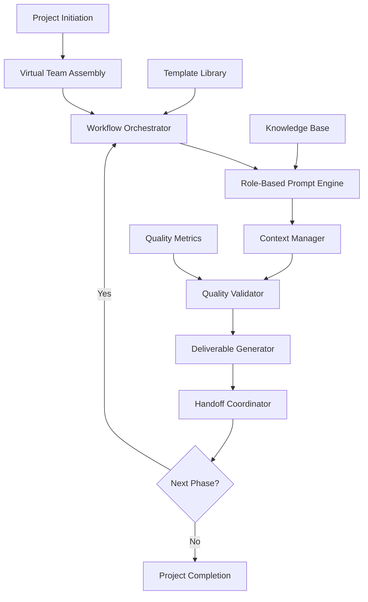

# Virtual AI Team Orchestration - Technical Architecture

## 🏗️ System Architecture Overview



## 🧩 Core Components

### 1. Virtual Team Assembly Engine

**Purpose**: Dynamically creates the optimal team composition based on project requirements

**Components**:
- **Role Analyzer**: Identifies required expertise areas
- **Team Composer**: Selects appropriate virtual team members
- **Skill Mapper**: Maps project needs to available role templates

**Example Team Compositions**:
```yaml
AI_Agent_Project:
  roles:
    - Project_Manager
    - AI_Researcher
    - Solution_Architect
    - Python_Developer
    - RAG_Specialist
    - QA_Engineer
    - Documentation_Specialist

Web_Application:
  roles:
    - Project_Manager
    - UX_Designer
    - Frontend_Developer
    - Backend_Developer
    - Database_Architect
    - Security_Specialist
    - QA_Engineer
```

### 2. Workflow Orchestrator

**Purpose**: Manages the sequential and parallel execution of project phases

**Key Features**:
- **Phase Management**: Controls progression through project stages
- **Dependency Tracking**: Ensures prerequisites are met before phase transitions
- **Parallel Processing**: Enables concurrent work streams where appropriate
- **Adaptive Routing**: Adjusts workflow based on project complexity and outcomes

**Workflow State Machine**:
```yaml
phases:
  1_discovery:
    roles: [Project_Manager, Business_Analyst]
    deliverables: [requirements_doc, scope_definition]
    next: 2_research
    
  2_research:
    roles: [Tech_Researcher, Solution_Architect]
    deliverables: [tech_stack_analysis, architecture_proposal]
    next: 3_design
    
  3_design:
    roles: [Solution_Architect, UX_Designer]
    deliverables: [system_design, ui_mockups]
    next: 4_implementation
    
  4_implementation:
    roles: [Developer, Database_Specialist]
    deliverables: [code_modules, database_schema]
    next: 5_testing
    
  5_testing:
    roles: [QA_Engineer, Security_Specialist]
    deliverables: [test_results, security_audit]
    next: 6_deployment
```

### 3. Role-Based Prompt Engine

**Purpose**: Generates contextually appropriate prompts for each virtual team member

**Prompt Structure**:
```markdown
# Role: {ROLE_NAME}
## Context
- Project: {PROJECT_NAME}
- Phase: {CURRENT_PHASE}
- Previous Deliverables: {HANDOFF_CONTEXT}

## Expertise
{ROLE_SPECIFIC_KNOWLEDGE}

## Objective
{PHASE_SPECIFIC_GOAL}

## Deliverables Expected
{STRUCTURED_OUTPUT_FORMAT}

## Quality Criteria
{VALIDATION_REQUIREMENTS}

## Collaboration Notes
{TEAM_INTERACTION_GUIDANCE}
```

**Dynamic Prompt Generation**:
```python
class PromptEngine:
    def generate_role_prompt(self, role, context, phase):
        base_template = self.load_role_template(role)
        context_injection = self.prepare_context(context, phase)
        quality_criteria = self.get_quality_standards(role, phase)
        
        return self.compile_prompt(
            template=base_template,
            context=context_injection,
            criteria=quality_criteria
        )
```

### 4. Context Management System

**Purpose**: Maintains project state and enables seamless handoffs between virtual team members

**Context Structure**:
```json
{
  "project_id": "control_m_ai_agent",
  "current_phase": "implementation",
  "team_composition": ["pm", "architect", "developer", "qa"],
  "deliverables": {
    "requirements": {
      "status": "completed",
      "content": "...",
      "quality_score": 0.92
    },
    "architecture": {
      "status": "in_progress",
      "content": "...",
      "assigned_to": "solution_architect"
    }
  },
  "decisions": [
    {
      "decision": "Use LangChain for RAG implementation",
      "rationale": "Better integration with existing tools",
      "made_by": "solution_architect",
      "phase": "design"
    }
  ],
  "quality_metrics": {
    "overall_score": 0.89,
    "phase_scores": {"discovery": 0.95, "design": 0.87}
  }
}
```

**Context Compression Algorithm**:
```python
class ContextManager:
    def compress_context(self, full_context, target_role, current_phase):
        # Extract role-relevant information
        relevant_deliverables = self.filter_by_relevance(full_context, target_role)
        
        # Summarize previous phases
        phase_summary = self.summarize_completed_phases(full_context)
        
        # Highlight critical decisions
        key_decisions = self.extract_critical_decisions(full_context, current_phase)
        
        return {
            "summary": phase_summary,
            "relevant_deliverables": relevant_deliverables,
            "key_decisions": key_decisions,
            "current_objectives": self.get_phase_objectives(current_phase)
        }
```

### 5. Quality Validation Framework

**Purpose**: Ensures consistent quality across all deliverables and phases

**Multi-Layer Validation**:
```yaml
validation_layers:
  1_syntax_check:
    - Code compilation/syntax validation
    - Document structure verification
    - Format compliance checking
    
  2_content_quality:
    - Completeness assessment
    - Accuracy verification
    - Best practices compliance
    
  3_integration_validation:
    - Consistency with previous deliverables
    - Alignment with project objectives
    - Stakeholder requirement satisfaction
    
  4_peer_review:
    - Cross-role validation
    - Alternative approach consideration
    - Risk assessment
```

**Quality Scoring Algorithm**:
```python
class QualityValidator:
    def assess_deliverable(self, deliverable, role, phase):
        scores = {
            'completeness': self.check_completeness(deliverable),
            'accuracy': self.verify_accuracy(deliverable),
            'best_practices': self.evaluate_practices(deliverable, role),
            'consistency': self.check_consistency(deliverable, self.context),
            'innovation': self.assess_innovation(deliverable)
        }
        
        weighted_score = sum(
            score * self.get_weight(metric, role, phase)
            for metric, score in scores.items()
        )
        
        return {
            'overall_score': weighted_score,
            'detailed_scores': scores,
            'recommendations': self.generate_improvements(scores)
        }
```

## 🔄 Workflow Execution Patterns

### Sequential Pattern
```
Phase 1 → Phase 2 → Phase 3 → Phase 4
   ↓        ↓        ↓        ↓
 Output   Output   Output   Final
```

### Parallel Pattern
```
Phase 1 → ┌─ Phase 2A ─┐
          │             │ → Phase 4
          └─ Phase 2B ─┘
```

### Iterative Pattern
```
Phase 1 → Phase 2 → Phase 3
    ↑         ↓         ↓
    └─── Feedback ←────┘
```

## 🛠️ Implementation Technologies

### Core Stack
- **Language**: Python 3.9+
- **Framework**: FastAPI for API layer
- **Database**: SQLite for local storage, PostgreSQL for production
- **Caching**: Redis for context management
- **Configuration**: YAML for templates and workflows

### AI Integration
- **LLM Interface**: OpenAI API, Anthropic Claude, or local models
- **Prompt Management**: Custom template engine with Jinja2
- **Context Compression**: Custom algorithms with fallback to summarization models
- **Quality Assessment**: Rule-based + ML-based validation

### IDE Integration
- **VS Code Extension**: Custom extension for workflow management
- **Cursor Integration**: Plugin for seamless AI interaction
- **File Management**: Automated project structure creation
- **Progress Tracking**: Real-time phase and deliverable status

## 📊 Performance Considerations

### Scalability Metrics
- **Context Size**: Optimized for 10K-50K token contexts
- **Response Time**: <30 seconds per role interaction
- **Concurrent Projects**: Support for 10+ simultaneous projects
- **Template Library**: 100+ role templates, 50+ workflow patterns

### Optimization Strategies
- **Lazy Loading**: Load role templates and contexts on demand
- **Caching**: Cache frequently used prompts and contexts
- **Compression**: Intelligent context summarization for long projects
- **Parallel Processing**: Concurrent execution of independent phases

## 🔒 Security and Privacy

### Data Protection
- **Local Storage**: Sensitive project data stored locally by default
- **Encryption**: AES-256 encryption for stored contexts
- **API Security**: Secure token management for LLM APIs
- **Access Control**: Role-based access to project data

### Privacy Considerations
- **Data Minimization**: Only necessary context shared with LLMs
- **Anonymization**: Option to anonymize sensitive information
- **Audit Trail**: Complete logging of all AI interactions
- **Compliance**: GDPR and enterprise security standard compliance

This architecture provides a robust foundation for implementing the Virtual AI Team Orchestration framework while maintaining flexibility for future enhancements and customizations.