# Implementation Roadmap - Virtual AI Team Orchestration

## Technical Implementation Journey

This document provides detailed Mermaid diagrams showing how to build the Virtual AI Team Orchestration Framework from concept to production.

## Phase 1: Foundation & Core Components

```mermaid
flowchart TD
    A["🎯 Week 1-2: Foundation Setup"] --> B["📁 Project Structure"]
    A --> C["🔧 Core Dependencies"]
    A --> D["🗄️ Database Schema"]
    
    B --> E["📂 /src/core/"]
    B --> F["📂 /src/roles/"]
    B --> G["📂 /src/prompts/"]
    B --> H["📂 /src/ui/"]
    
    C --> I["🤖 LLM SDK Integration"]
    C --> J["🗄️ SQLite/PostgreSQL"]
    C --> K["🔌 IDE Extension APIs"]
    
    D --> L["📊 Context Tables"]
    D --> M["👥 Team Configuration"]
    D --> N["📈 Metrics Storage"]
    
    E --> O["⚙️ Orchestrator Class"]
    F --> P["👤 Virtual Role Classes"]
    G --> Q["📝 Prompt Templates"]
    H --> R["🖥️ Feedback Interface"]
    
    style A fill:#e3f2fd
    style O fill:#c8e6c9
    style P fill:#c8e6c9
    style Q fill:#c8e6c9
    style R fill:#c8e6c9
```

## Phase 2: Core Orchestration Engine

```mermaid
flowchart TD
    A["🔧 Week 3-4: Orchestration Engine"] --> B["🎭 Virtual Team Assembly"]
    A --> C["🔄 Workflow Management"]
    A --> D["🧠 Context Management"]
    
    B --> E["🏗️ Role Factory Pattern"]
    B --> F["📋 Team Composition Logic"]
    B --> G["⚖️ Load Balancing"]
    
    C --> H["📊 State Machine"]
    C --> I["🔄 Phase Transitions"]
    C --> J["⏸️ Human Intervention Points"]
    
    D --> K["💾 Context Persistence"]
    D --> L["🔗 Cross-Role Sharing"]
    D --> M["📚 Knowledge Base"]
    
    E --> N["class RoleFactory"]
    F --> O["class TeamComposer"]
    G --> P["class LoadBalancer"]
    
    H --> Q["class WorkflowStateMachine"]
    I --> R["class PhaseManager"]
    J --> S["class HumanGateway"]
    
    K --> T["class ContextManager"]
    L --> U["class KnowledgeGraph"]
    M --> V["class SemanticSearch"]
    
    style A fill:#e8f5e8
    style N fill:#fff3e0
    style O fill:#fff3e0
    style P fill:#fff3e0
    style Q fill:#fff3e0
    style R fill:#fff3e0
    style S fill:#fff3e0
    style T fill:#fff3e0
    style U fill:#fff3e0
    style V fill:#fff3e0
```

## Phase 3: IDE Integration & Human Interface

```mermaid
flowchart TD
    A["🖥️ Week 5-6: IDE Integration"] --> B["🔌 Extension Development"]
    A --> C["👤 Human Interface"]
    A --> D["📊 Analytics & Monitoring"]
    
    B --> E["📦 VS Code Extension"]
    B --> F["🧩 JetBrains Plugin"]
    B --> G["⚡ Cursor Integration"]
    
    C --> H["🔔 Notification System"]
    C --> I["💬 Chat Interface"]
    C --> J["📋 Review Dashboard"]
    
    D --> K["📈 Performance Metrics"]
    D --> L["🎯 Success Tracking"]
    D --> M["🔍 Usage Analytics"]
    
    E --> N["TypeScript/JavaScript"]
    F --> O["Kotlin/Java"]
    G --> P["React/Electron"]
    
    H --> Q["Toast Notifications"]
    I --> R["Embedded Chat Panel"]
    J --> S["Web Dashboard"]
    
    K --> T["Real-time Metrics"]
    L --> U["Goal Achievement"]
    M --> V["User Behavior"]
    
    style A fill:#f3e5f5
    style N fill:#e1f5fe
    style O fill:#e1f5fe
    style P fill:#e1f5fe
    style Q fill:#e1f5fe
    style R fill:#e1f5fe
    style S fill:#e1f5fe
    style T fill:#e1f5fe
    style U fill:#e1f5fe
    style V fill:#e1f5fe
```

## Technical Architecture Implementation

## Development Milestones & Deliverables

## Quality Gates & Validation Points

```mermaid
flowchart LR
    A["📝 Code Complete"] --> B{"🧪 Unit Tests Pass?"}
    B -->|Yes| C{"🔗 Integration Tests Pass?"}
    B -->|No| D["🔧 Fix Issues"]
    D --> A
    
    C -->|Yes| E{"👤 Human Review Approved?"}
    C -->|No| D
    
    E -->|Yes| F{"📊 Performance Benchmarks Met?"}
    E -->|No| G["📋 Address Feedback"]
    G --> A
    
    F -->|Yes| H{"🔒 Security Scan Clean?"}
    F -->|No| I["⚡ Optimize Performance"]
    I --> A
    
    H -->|Yes| J["✅ Ready for Deployment"]
    H -->|No| K["🛡️ Fix Security Issues"]
    K --> A
    
    J --> L["🚀 Deploy to Production"]
    
    style B fill:#fff3e0
    style C fill:#fff3e0
    style E fill:#fff3e0
    style F fill:#fff3e0
    style H fill:#fff3e0
    style J fill:#c8e6c9
```

## Success Metrics Dashboard

## Risk Mitigation Strategy

```mermaid
flowchart TD
    A["⚠️ Identified Risks"] --> B["🤖 AI Response Quality"]
    A --> C["👤 Human Adoption"]
    A --> D["🔧 Technical Complexity"]
    A --> E["📊 Performance Issues"]
    
    B --> F["✅ Mitigation: Prompt Engineering + Validation"]
    C --> G["✅ Mitigation: Gradual Rollout + Training"]
    D --> H["✅ Mitigation: Modular Architecture + Testing"]
    E --> I["✅ Mitigation: Caching + Optimization"]
    
    F --> J["📈 Success Indicator: >90% Accuracy"]
    G --> K["📈 Success Indicator: >80% Adoption"]
    H --> L["📈 Success Indicator: <2s Response Time"]
    I --> M["📈 Success Indicator: <500ms Latency"]
    
    style A fill:#ffebee
    style F fill:#e8f5e8
    style G fill:#e8f5e8
    style H fill:#e8f5e8
    style I fill:#e8f5e8
```

This implementation roadmap provides a clear, step-by-step approach to building the Virtual AI Team Orchestration Framework, with specific technical milestones, quality gates, and success metrics to ensure successful delivery.