# Technical Architecture & Data Flow Diagrams

## Complete System Architecture

This document provides detailed technical diagrams showing the internal workings of the Virtual AI Team Orchestration Framework.

## System Component Architecture

## Data Flow Architecture

```mermaid
flowchart TD
    subgraph "🖥️ IDE Layer"
        A["👤 Developer Input"]
        B["🔌 Extension Interface"]
        C["📱 Feedback UI"]
    end
    
    subgraph "🎭 Orchestration Layer"
        D["🎯 Project Orchestrator"]
        E["👥 Team Manager"]
        F["🔄 Workflow Engine"]
        G["⚖️ Quality Validator"]
    end
    
    subgraph "🧠 AI Processing Layer"
        H["📝 Prompt Generator"]
        I["🤖 LLM Interface"]
        J["🔍 Response Parser"]
        K["🎭 Role Simulator"]
    end
    
    subgraph "💾 Data Layer"
        L["🗄️ Context Database"]
        M["📚 Knowledge Base"]
        N["📊 Metrics Store"]
        O["🔄 Cache Layer"]
    end
    
    subgraph "🔧 Integration Layer"
        P["📁 File System"]
        Q["🌐 Git Integration"]
        R["🚀 CI/CD Hooks"]
        S["📊 Analytics API"]
    end
    
    A --> B
    B --> D
    C <--> D
    
    D --> E
    D --> F
    D --> G
    
    E --> H
    F --> H
    G --> H
    
    H --> I
    I --> J
    J --> K
    K --> E
    
    D <--> L
    E <--> M
    F <--> N
    I <--> O
    
    D --> P
    D --> Q
    F --> R
    G --> S
    
    style A fill:#e3f2fd
    style D fill:#e8f5e8
    style I fill:#fff3e0
    style L fill:#f3e5f5
```

## Virtual Team Execution Flow

```mermaid
sequenceDiagram
    participant Dev as 👤 Developer
    participant Orch as 🎯 Orchestrator
    participant PM as 📊 Project Manager
    participant SA as 🏗️ Solution Architect
    participant TL as 💻 Technical Lead
    participant QA as 🧪 QA Engineer
    participant LLM as 🤖 LLM API
    participant DB as 💾 Context DB
    
    Dev->>Orch: Initialize project with requirements
    Orch->>DB: Store project context
    Orch->>PM: Analyze requirements
    PM->>LLM: Generate project plan prompt
    LLM->>PM: Return structured plan
    PM->>Orch: Submit project plan
    
    Orch->>Dev: Request approval for plan
    Dev->>Orch: Approve with modifications
    Orch->>DB: Update context with decisions
    
    Orch->>SA: Design system architecture
    SA->>LLM: Generate architecture prompt
    LLM->>SA: Return architecture design
    SA->>Orch: Submit architecture
    
    Orch->>TL: Implement solution
    TL->>DB: Retrieve context & architecture
    TL->>LLM: Generate implementation prompt
    LLM->>TL: Return code implementation
    TL->>Orch: Submit code for review
    
    Orch->>QA: Validate implementation
    QA->>LLM: Generate test cases
    LLM->>QA: Return test suite
    QA->>Orch: Submit quality report
    
    Orch->>Dev: Present final deliverable
    Dev->>Orch: Accept delivery
    Orch->>DB: Archive project completion
```

## Context Management System

## Prompt Engineering Pipeline

## Human Feedback Integration Architecture

## Performance Optimization Architecture

```mermaid
flowchart TD
    subgraph "⚡ Performance Layer"
        A["🔄 Request Router"]
        B["💾 Response Cache"]
        C["⚖️ Load Balancer"]
        D["📊 Performance Monitor"]
    end
    
    subgraph "🚀 Optimization Strategies"
        E["🔄 Parallel Processing"]
        F["📦 Batch Operations"]
        G["🎯 Smart Caching"]
        H["📈 Predictive Prefetch"]
    end
    
    subgraph "📊 Monitoring & Analytics"
        I["⏱️ Response Time Tracking"]
        J["🎯 Accuracy Metrics"]
        K["💰 Cost Optimization"]
        L["👤 User Satisfaction"]
    end
    
    A --> E
    B --> G
    C --> F
    D --> H
    
    E --> I
    F --> I
    G --> J
    H --> K
    
    I --> L
    J --> L
    K --> L
    
    style A fill:#e3f2fd
    style E fill:#e8f5e8
    style I fill:#fff3e0
```

## Security & Privacy Architecture

```mermaid
flowchart LR
    subgraph "🔒 Security Layer"
        A["🔐 Authentication"]
        B["🛡️ Authorization"]
        C["🔒 Encryption"]
        D["📝 Audit Logging"]
    end
    
    subgraph "🛡️ Privacy Controls"
        E["🎭 Data Anonymization"]
        F["🗑️ Data Retention"]
        G["🔄 Data Minimization"]
        H["👤 Consent Management"]
    end
    
    subgraph "🔍 Compliance"
        I["📋 GDPR Compliance"]
        J["🏢 SOC 2 Type II"]
        K["🔒 ISO 27001"]
        L["📊 Regular Audits"]
    end
    
    A --> E
    B --> F
    C --> G
    D --> H
    
    E --> I
    F --> J
    G --> K
    H --> L
    
    style A fill:#ffebee
    style E fill:#e8f5e8
    style I fill:#e3f2fd
```

## Deployment Architecture

This comprehensive technical architecture demonstrates how the Virtual AI Team Orchestration Framework operates at the code level, from initial project requirements through to final product delivery, with robust security, performance optimization, and human oversight integration.