# Virtual AI Team Orchestration - Complete Workflow Diagram

## End-to-End Project Delivery Flow

This diagram illustrates how the Virtual AI Team Orchestration Framework transforms initial project requirements into a delivered product through coordinated AI expert collaboration.

```mermaid
flowchart TD
    A["📋 Initial Project Requirements"] --> B["🚀 Project Initialization"]
    B --> C["🤖 Virtual Team Assembly"]
    
    C --> D["👥 Team Composition"]
    D --> E["📊 Project Manager"]
    D --> F["🏗️ Solution Architect"]
    D --> G["🔬 AI Researcher"]
    D --> H["💻 Technical Lead"]
    D --> I["🧪 QA Engineer"]
    D --> J["⚙️ DevOps Engineer"]
    
    E --> K["📈 Discovery & Planning Phase"]
    F --> K
    G --> K
    H --> K
    I --> K
    J --> K
    
    K --> L["🔍 Requirements Analysis"]
    K --> M["🎯 Scope Definition"]
    K --> N["📐 Architecture Design"]
    K --> O["🛣️ Implementation Roadmap"]
    
    L --> P["👤 Human Review Point 1"]
    M --> P
    N --> P
    O --> P
    
    P -->|"✅ Approved"| Q["🔨 Implementation & Delivery Phase"]
    P -->|"❌ Needs Revision"| K
    
    Q --> R["💡 Solution Development"]
    Q --> S["🧪 Testing & Validation"]
    Q --> T["📦 Deployment Preparation"]
    
    R --> U["🔄 Iterative Development Cycles"]
    U --> V["📝 Code Generation"]
    U --> W["🔍 Code Review"]
    U --> X["🧪 Unit Testing"]
    U --> Y["📊 Progress Tracking"]
    
    V --> Z["👤 Human Review Point 2"]
    W --> Z
    X --> Z
    Y --> Z
    
    Z -->|"✅ Continue"| AA["🔄 Next Iteration"]
    Z -->|"❌ Adjust"| U
    Z -->|"✅ Phase Complete"| S
    
    AA --> U
    
    S --> BB["🧪 Integration Testing"]
    S --> CC["🔒 Security Validation"]
    S --> DD["⚡ Performance Testing"]
    S --> EE["👥 User Acceptance Testing"]
    
    BB --> FF["👤 Human Review Point 3"]
    CC --> FF
    DD --> FF
    EE --> FF
    
    FF -->|"✅ Quality Approved"| T
    FF -->|"❌ Issues Found"| R
    
    T --> GG["🚀 Deployment Strategy"]
    T --> HH["📚 Documentation"]
    T --> II["🎓 Training Materials"]
    T --> JJ["🔧 Monitoring Setup"]
    
    GG --> KK["👤 Human Review Point 4"]
    HH --> KK
    II --> KK
    JJ --> KK
    
    KK -->|"✅ Ready for Deployment"| LL["🎯 Product Delivery"]
    KK -->|"❌ Needs Refinement"| T
    
    LL --> MM["🚀 Production Deployment"]
    LL --> NN["📊 Monitoring & Analytics"]
    LL --> OO["🎉 Project Completion"]
    
    MM --> PP["🔄 Post-Deployment Support"]
    NN --> PP
    OO --> PP
    
    PP --> QQ["📈 Success Metrics"]
    PP --> RR["🔧 Maintenance Plan"]
    PP --> SS["📚 Knowledge Transfer"]
    
    style A fill:#e1f5fe
    style B fill:#f3e5f5
    style C fill:#e8f5e8
    style P fill:#fff3e0
    style Z fill:#fff3e0
    style FF fill:#fff3e0
    style KK fill:#fff3e0
    style LL fill:#e8f5e8
    style OO fill:#c8e6c9
```

## Human Feedback Integration Points

```mermaid
flowchart LR
    A["🎯 Project Start"] --> B["👤 Human Review Point 1<br/>Requirements & Architecture"]
    B --> C["🔄 Development Cycles"]
    C --> D["👤 Human Review Point 2<br/>Code & Progress"]
    D --> E["🧪 Testing Phase"]
    E --> F["👤 Human Review Point 3<br/>Quality Validation"]
    F --> G["📦 Deployment Prep"]
    G --> H["👤 Human Review Point 4<br/>Deployment Readiness"]
    H --> I["🎉 Product Delivery"]
    
    style B fill:#fff3e0
    style D fill:#fff3e0
    style F fill:#fff3e0
    style H fill:#fff3e0
```

## Virtual Team Collaboration Matrix

```mermaid
graph TB
    subgraph "🎯 Discovery & Planning"
        PM1["📊 Project Manager<br/>• Requirements gathering<br/>• Stakeholder alignment<br/>• Timeline planning"]
        SA1["🏗️ Solution Architect<br/>• System design<br/>• Technology selection<br/>• Architecture patterns"]
        AR1["🔬 AI Researcher<br/>• Domain analysis<br/>• AI/ML feasibility<br/>• Research insights"]
    end
    
    subgraph "🔨 Implementation & Delivery"
        TL1["💻 Technical Lead<br/>• Code architecture<br/>• Development standards<br/>• Technical decisions"]
        QA1["🧪 QA Engineer<br/>• Test strategy<br/>• Quality metrics<br/>• Validation plans"]
        DO1["⚙️ DevOps Engineer<br/>• Infrastructure design<br/>• CI/CD pipeline<br/>• Deployment strategy"]
    end
    
    subgraph "🔄 Cross-Phase Activities"
        CTX["🧠 Context Management<br/>• Knowledge sharing<br/>• Decision tracking<br/>• Progress monitoring"]
        HF["👤 Human Feedback<br/>• Strategic decisions<br/>• Quality gates<br/>• Course corrections"]
    end
    
    PM1 -.-> TL1
    SA1 -.-> TL1
    SA1 -.-> DO1
    AR1 -.-> TL1
    TL1 -.-> QA1
    QA1 -.-> DO1
    
    PM1 --> CTX
    SA1 --> CTX
    AR1 --> CTX
    TL1 --> CTX
    QA1 --> CTX
    DO1 --> CTX
    
    CTX --> HF
    HF -.-> PM1
    HF -.-> SA1
    HF -.-> AR1
    HF -.-> TL1
    HF -.-> QA1
    HF -.-> DO1
```

## Technology Stack Integration

## Success Metrics & Outcomes

## Key Benefits Visualization

```mermaid
mindmap
  root((Virtual AI Team<br/>Orchestration))
    🚀 Speed
      10x faster development
      Parallel workstreams
      Automated workflows
    🎯 Quality
      Multi-expert validation
      Continuous testing
      Best practice enforcement
    🧠 Knowledge
      Domain expertise on-demand
      Consistent decision making
      Learning amplification
    👥 Collaboration
      Human-AI partnership
      Strategic control points
      Transparent processes
    📈 Scalability
      Unlimited virtual experts
      Consistent performance
      Cost-effective scaling
```

This comprehensive workflow demonstrates how the Virtual AI Team Orchestration Framework transforms traditional solo development into a collaborative, AI-enhanced process that delivers higher quality products faster while maintaining human oversight and control at critical decision points.